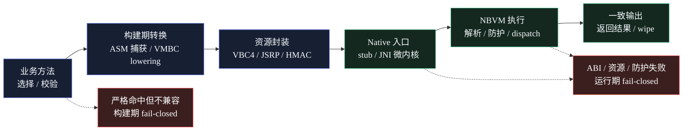

<p align="center">
  
</p>

<h1 align="center">JavaShroud</h1>

<p align="center">
  <strong>面向 Java 产物的混淆、虚拟化与 Native 加固工具链</strong>
</p>

<p align="center">
  
  
  
</p>
<p align="center">
  <strong>简体中文</strong> · <a href="README_EN.md">English</a>
</p>

## 发布状态

当前开发发布版本：`0.9.0-dev`。能力 schema 暴露的 engine version 为 `0.9.0-dev`，VBC capability version 为 `4.53`；底层 VMBC 线协议仍为 VBC4，以保持当前 native parser / serializer 合约稳定。

## 项目定位

JavaShroud 是一个以 Java 字节码变换、方法虚拟化、Native 微内核和桌面化工作流为核心的混淆与加固项目。它既包含传统 Java 混淆器常见的重命名、字符串保护、控制流扰动和元数据清理，也提供面向高价值方法的 VMBC / NBVM (native bytecode VM) 执行链。

本项目的开发理念接近 Kerckhoffs 原则：保护强度不应建立在“算法和实现永远不公开”的假设上，而应尽量来自每个产物自身的密钥材料、结构扰动、运行时认证、上下文绑定和跨 Java / Native 的执行边界。

需要明确的是，JavaShroud 保护的是自包含交付物。密钥材料、运行时逻辑和受保护代码最终都必须随产物一起分发，因此它不可能像在线服务、HSM 或外部授权系统那样完全满足 Kerckhoffs 原则。

## VMBC 与 Native 执行链

JavaShroud 的 VMBC / NBVM 指向同一条代码链路：`method-virtualization` 将选中的 Java 方法转换为 VBC4 / VMBC 资源，由 `JniMicrokernelHelper.executeVmResource` 进入 native dispatcher，并在 `js_vm_execute_resource` 对应的 native bytecode VM 中执行。NBVM 在这里是 native bytecode VM 执行链的简称。

这条链路的核心价值是让原始方法体退出常规 Java 字节码形态，把关键语义放进认证资源、入口 token、opcode dialect、常量池、block dispatch 和 native 状态共同约束的执行协议中；代码中已经落地的关键机制包括：

| 层面 | 已实现机制 | 作用 |
| --- | --- | --- |
| 方法虚拟化 | VBC4-only、native-only、严格虚拟化、入口 token、dispatcher stub | 避免原始 Java 方法体长期以可反编译形式存在 |
| VMBC 编码 | opcode alias、super-operator folding、block split / coalesce、exception masking | 降低一对一恢复 opcode、控制流和异常边的稳定性 |
| 资源保护 | JSRP envelope、AES/CTR、HMAC、nonce、zstd section、decoy / slice / opaque path | 提高离线枚举、提取和重放 VMBC 资源的成本 |
| 密钥与状态 | per-build / per-method 材料、state-bound seed unwrap、runtime resource key、layout digest | 让公开算法不能直接变成跨样本通用解包脚本 |
| Native 运行时 | JNI 微内核、native VM parser / executor、register IR、lazy CP decrypt、resident masking、wipe | 缩短明文窗口，并把分析面扩展到 JVM 与 Native 边界 |
| 运行期防护 | anti-instrumentation、anti-dump、anti-JVMTI / agent 检测、trampoline 检测、完整性 gate | 对普通 hook、插桩、转储和替换加载形成额外阻力 |

### VMBC / NBVM 流程



### VMBC 加密 -> 解密 -> 执行链路

`method-virtualization` 并非将 Java 方法直接迁移为 native 函数，而是在构建期将方法体转换为 VBC4 / VMBC 资源，并在运行期由 sealed JNI 微内核完成认证、解密、解析和执行。当前实现的主要链路如下：

1. **构建期选择与捕获方法**：`MethodVirtualizationTransforms` 根据规则、`methodSelection`、`strictVirtualization`、指令数量上限和兼容性检查选择可虚拟化方法。命中的方法体会被 ASM 捕获；在严格虚拟化场景下，显式命中但 VBC4 不支持的方法会 fail-closed，而不是静默保留原始明文实现。
2. **Lowering 为 VMBC / register IR**：`VmBytecodeSerializer` 将 JVM bytecode lowering 为 VBC4 逻辑程序，并写入方法 metadata、常量池、异常表和 register-executable 指令块。序列化过程中会引入 opcode dialect、super-operator folding、block split / coalesce、block dispatch token、nested VM micro-stream 等结构差异化信息。
3. **VBC4 内层加密**：VBC4 payload 使用 per-build / per-method 派生材料。常量池索引、常量池 entry、指令 block、异常表和 padding 按 section / block 维度分别派生 AES/CTR key 与 IV；payload 末尾带 HMAC-SHA256，`wrappedSeed`、`nonce`、`layoutDigest`、entry token、resource path 与 session integrity material 共同参与校验和密钥派生。
4. **JSRP 外层资源封装**：生成的 VBC4 bytes 会被 `RuntimeResourceCodec` 封装为 `JSRP` runtime resource。外层资源包含加密 metadata、AES/CTR body、HMAC、nonce、kind / variant / layer 域和 plain / stored hash；可压缩资源使用 zstd section。VM 资源还可以进一步切片，并生成 manifest、decoy 和 opaque path，以降低稳定资源指纹。
5. **替换原方法体为 dispatcher stub**：原 Java 方法体被替换为轻量 stub。stub 携带或间接引用 `entryToken`、resource path 和参数数组，调用 `JniMicrokernelHelper.executeVmResource` / token-only 专用入口；热路径不再暴露原始业务指令序列。
6. **运行期加载 sealed native kernel**：`JniMicrokernelHelper` 只负责加载随 JAR 封装的 native 微内核、安装 runtime resource key、预加载 VM resource index，并做 ABI / boot-token / self-check。VBC4 模式没有 Java fallback；native 不可用、ABI 不匹配、资源认证失败或 token 不匹配都会拒绝执行。
7. **运行期解密与认证**：native 侧先解 `JSRP` envelope，再由 `js_vm_execute_resource` / `js_vm_execute_resource_by_token` 进入 VBC4 parser。`js_vm_core.c` 会检查 magic、版本、required flags、HMAC、key id、wrapped seed、layout / integrity 状态，然后按需解密 CP index、CP entry、instruction block 和 exception section；常量池 entry 采用 lazy decrypt，减少明文常驻时间。
8. **Native VM 执行与清理**：解析后的 register IR 交给 native dispatcher 执行。执行期间会穿插 block dispatch 校验、resident masking、opcode mask、anti-trace / trampoline 检测和异常语义处理；执行结束或失败路径会通过 `js_vbc4_wipe_volatile` 清理 program、CP、symbol cache、decoded operands 和派生密钥材料。

数据流概览如下：

```text
原 Java 方法体
  -> ASM 捕获与兼容性校验
  -> VBC4 / VMBC register IR
  -> 分区加密的 VBC4 payload + HMAC
  -> JSRP runtime resource / slice / manifest / decoy
  -> Java dispatcher stub(entryToken, args)
  -> sealed JNI native VM 解包、解密、执行、wipe
```

该链路的安全边界是实例化后的执行协议，而非单点算法保密。即使格式和实现公开，不同产物仍具有不同的构建根材料、runtime resource key、layout digest、resource path、entry token、opcode dialect、block 布局和 native profile。该设计不承诺不可逆保护；具备目标环境、足够权限和分析时间的定向逆向仍可动态跟踪运行态。JavaShroud 的目标是降低单次分析结果复用为跨样本通用 VMBC 解包与还原模板的可行性。

这些能力的边界同样需要诚实说明：`method-virtualization` 只保护被选中且兼容的方法；未虚拟化的方法仍是普通字节码混淆问题。自包含产物中仍然存在完成执行所需的全部材料，具备足够时间和权限的定向逆向仍可逐层推进。

## 与 JNIC / Native 混淆的区别

传统 JNIC 或 Native 混淆通常把 Java 方法转换为 C/C++ 代码，再通过 JNI 调用本地函数。它的主要保护边界是 Java 到 Native 的迁移：Java 层暴露减少，攻击者需要进入本地库、符号、导出函数和机器码层面分析。

JavaShroud 的 VMBC 路线更偏向虚拟执行模型。Native 层不是单纯承载“翻译后的方法函数”，而是参与资源认证、VMBC 解析、指令调度、状态绑定和运行期校验。攻击者即使进入 Native 层，面对的也不是一个与原 Java 方法一一对应的本地函数，而是一套跨 Java stub、VMBC resource、JNI microkernel 和 native VM 状态的执行协议。

| 维度 | JNIC / Native 混淆 | JavaShroud VMBC / NBVM 路线 |
| --- | --- | --- |
| 核心思路 | 将 Java 方法迁移为 Native 函数 | 将方法语义转换为 VMBC 资源并由 native VM 执行 |
| 主要分析对象 | JNI 桥、导出函数、机器码、符号恢复 | dispatcher stub、资源封装、虚拟指令、解释器状态、Native 边界 |
| 开源后的主要风险 | 固定转换模板和 JNI 形态可被模式化识别 | 仍可研究实现，但需要适配产物级材料、布局和运行时协议 |
| 动态观测难点 | Hook JNI 或本地函数参数 / 返回值 | 需要同时恢复 VM 状态、指令语义、密钥派生和调度路径 |
| 工程取舍 | 适合迁移少量关键方法到本地代码 | 适合对高价值 Java 逻辑做体系化虚拟化和差异化保护 |

两者并不互斥。JavaShroud 更像是在 Native 边界之上增加一层虚拟机协议和产物实例化机制，让 Native 不只是“藏代码的位置”，而是执行模型本身的一部分。

## 常规能力

除 VMBC / native VM 路线外，JavaShroud 当前可执行绑定覆盖 26 个 pass，按模块大致分为：

| 模块 | 代表能力 |
| --- | --- |
| Metadata | 编译调试信息、行号、局部变量和源信息清理 |
| Renaming | 类、包、方法、字段重命名 |
| Encryption | 字符串加密、字段字符串加密 |
| Obfuscation | 整数常量混淆、静态初始化扰动、反反编译结构、invokedynamic 间接化、控制流混淆、引用代理、控制流平坦化、condy 常量间接化 |
| Loader protection | 类加密加载器、方法体延迟解密 |
| Runtime defense | 调用点轮换、环境绑定密钥、反符号执行、异常语义虚拟化 |
| Native kernel | 反插桩、反转储、JNI 微内核加载器 |

默认 pipeline 保持保守，高风险能力默认关闭，需要在规则配置中显式启用。强保护 pass 往往会带来兼容性、性能和调试成本，应优先用于授权保护场景中的关键类或关键方法。

## 技术栈

| 层 | 技术 |
| --- | --- |
| 核心引擎 | Kotlin 2.1、JDK 21、ASM 9.9、Jackson TOML、Gradle |
| Native runtime | C11、JNI、Zig / MSVC 构建链、zstd vendored decompression sources |
| 桌面端 | Go、Wails v2、WebView2 |
| 前端 | Vue 3、Vite、TypeScript、Naive UI、lucide-vue-next、xterm、Tailwind CSS |
| 测试 | Kotlin test / JUnit Platform、Go test、前端 parser check 脚本 |

## 常用命令

### 核心引擎

```powershell
# 构建核心引擎 JAR
.\gradlew.bat :core-engine:jar

# 运行核心引擎测试
.\gradlew.bat :core-engine:test

# 查看引擎 schema
java -jar build\core-engine\libs\obfuscator-engine.jar -schema

# 使用配置处理 JAR，参数以实际 CLI schema 为准
java -jar build\core-engine\libs\obfuscator-engine.jar -config path\to\config.toml
```

### 桌面前端

```powershell
# 安装前端依赖
corepack yarn --cwd desktop-app\frontend install --immutable

# 构建 Vue / Vite 前端
corepack yarn --cwd desktop-app\frontend build

# 运行前端能力解析检查
corepack yarn --cwd desktop-app\frontend check:capabilities
corepack yarn --cwd desktop-app\frontend check:events
```

### 桌面宿主

```powershell
# 校验 Go / Wails 侧代码
Set-Location desktop-app
go build ./...
go test ./...

# Wails 构建，需本机已安装 wails CLI
wails build
```

### Windows 发布

```powershell
# 完整发布入口
.\build-release.bat
```

完整发布脚本会构建 engine JAR、GraalVM native engine、前端 bundle 和 Wails 桌面程序。发布验收应以 `build\release\javashroud-windows-amd64\javashroud.exe` 等目标产物存在且可运行为准，而不是只看单个 Gradle、Yarn 或 Go 命令成功。

## 目录结构

```text
.
├─ core-engine/                 # Kotlin/Java 核心混淆引擎
│  ├─ src/main/kotlin/          # pass、schema、artifact、VMBC、runtime resource 等实现
│  ├─ src/main/java/            # 运行期 helper，包含 JNI microkernel helper 与防护 helper
│  ├─ src/main/native/          # C/JNI native runtime、VM executor、anti-debug、zstd vendored sources
│  └─ src/test/kotlin/          # 引擎、pass、VMBC、native、回归测试
├─ desktop-app/                 # Wails 桌面应用宿主
│  ├─ frontend/                 # Vue 3 + Vite + TypeScript 前端
│  ├─ *.go                      # Go/Wails 后端、引擎进程桥接、事件桥接
│  └─ wails.json                # Wails 配置
├─ gradle/                      # Gradle wrapper
├─ assets/                      # README 与发布展示资源
├─ build-release.bat            # Windows 发布入口
├─ LICENSE                      # GPLv3 许可证文本
├─ THIRD_PARTY_NOTICES.md       # 第三方组件声明
└─ SECURITY.md                  # 安全与授权使用说明
```

## 许可证与第三方组件

JavaShroud 基于 GNU General Public License Version 3 开源许可证发布。使用、修改、分发本项目或其衍生作品时，需要遵守 GPLv3 关于源码提供、版权声明保留和衍生作品授权方式的要求。

本项目同时依赖或随仓库分发若干第三方组件。特别地，`core-engine/src/main/native/zstd/` vendored 了 Zstandard 解压相关源码，仓库的 `THIRD_PARTY_NOTICES.md` 和 `NOTICE` 说明 JavaShroud 采用其 BSD-style license 选项。ASM、Jackson、Kotlin、Gradle、JUnit、Wails、Vue、Vite、TypeScript、Naive UI、lucide、xterm、Go 依赖等组件仍分别适用其原始许可证；再分发二进制或源码包时应保留相应版权、许可证和 NOTICE 信息。

## 致谢

JavaShroud 的设计与实现参考、学习并对比了许多开源混淆、虚拟化和 Native 保护项目。没有这些项目长期积累的工程经验，就不会有 JavaShroud 当前的方向。

- [Open-MyJ2c](https://github.com/MyJ2c/Open-MyJ2c)
- [native-obfuscator](https://github.com/radioegor146/native-obfuscator)
- [skidfuscator-java-obfuscator](https://github.com/skidfuscatordev/skidfuscator-java-obfuscator)
- [Tigress_protection](https://github.com/JonathanSalwan/Tigress_protection)
- code-encryptor-master
- jar-obfuscator-main
- obfuscator-master
