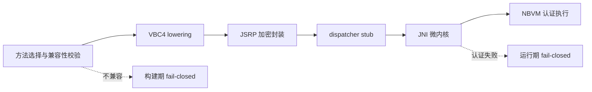

<p align="center">
  
</p>

<h1 align="center">JavaShroud</h1>

<p align="center">
  <strong>面向 Java 产物的混淆、虚拟化与 Native 加壳工具链</strong>
</p>

<p align="center">
  
  
  
  
</p>
<p align="center">
  <strong>简体中文</strong> · <a href="README_EN.md">English</a>
</p>

## 项目定位

JavaShroud 是一套 Java 混淆与加固工具链：Kotlin 引擎做字节码变换，选中的方法可以 lowering 成 VMBC 资源交给 Native bytecode VM（NBVM）执行，桌面端（Wails + Vue）负责配置编辑和任务管理。

设计取向接近 Kerckhoffs 原则：保护强度来自每份产物独立生成的密钥、布局、opcode 方言和 Java / Native 执行边界，不依赖实现细节长期保密。产物自带运行所需的全部材料，所以这里的目标是拉高分析和跨样本复用的成本，而不是宣称绝对不可逆。

## 核心能力

| 模块 | pass / 入口 |
| --- | --- |
| 重命名 | `rename-classes`、`rename-packages`、`rename-methods`、`rename-fields`（stable） |
| 常量与字符串 | `integer-constant-obfuscation`、`string-encryption`、`field-string-encryption` |
| 控制流 | `control-flow-obfuscation`、`control-flow-flattening`、`reference-proxy`、`invoke-dynamic-indirection`、`condy-constant-indirection` |
| 方法虚拟化 | `method-virtualization`：JVM bytecode lowering 为 VBC4，由 NBVM 执行 |
| 资源与类加密 | JSRP 资源封装、`class-encryption-loader`、`method-body-delayed-decryption` |
| 运行时防护 | `anti-instrumentation`、`anti-dump-protection`、`environment-bound-keys`、`callsite-rotation-protection`、`anti-symbolic-execution`、`exception-semantic-virtualization` |
| Native 加壳 | `jni-microkernel-loader`：认证外壳 + inner kernel 封装 + 平台 loader |
| 桌面工作流 | Wails + Vue 界面、配置编辑、引擎任务管理 |

注册 pass 共 26 个，默认 pipeline 只含 `strip-compile-debug-info`。stable pass 默认启用；experimental pass 需在配置里显式打开，其中带 opt-in 标记的还要求 `allowOptInPasses = true`。完整清单、参数和启用边界见 [docs/TECHNICAL.md](docs/TECHNICAL.md)。

## 资源封装：JSRP

JSRP 是项目内部的受保护资源封装格式（magic `JSRP`，当前版本 7）。VM 字节码、Native 库、manifest、bootstrap 索引统一经 `RuntimeResourceCodec` 封装：

- 结构为 27 字节 header + 96 字节加密 metadata + AES-CTR body + 32 字节 HMAC-SHA256 tag；metadata 与 body 的密钥、IV 由分区密钥经 HMAC 域分离派生。
- 密钥来自构建期 CSPRNG 生成的分区密钥表（`RuntimeKeyPartitions`），按资源分区选取；header、metadata、body 任何一处改动都会让 tag 校验失败。
- body 默认先经 zstd 压缩（`Vbc4ZstdCodec`）；metadata 记录原文与压缩后的 SHA-256，解码时逐级核对长度与哈希。

协议字段与解码流程见 [docs/TECHNICAL.md](docs/TECHNICAL.md)。

## VMBC / NBVM 执行链

`method-virtualization` 把选中的 Java 方法 lowering 成 VBC4 字节码（`VmBytecodeSerializer`），封装为 JSRP 资源；原方法体替换成 dispatcher stub。运行时 stub 调 `JniMicrokernelHelper.executeVmResource(entryToken, …)` 进入 JNI 微内核，由 `js_vm_execute_resource` 对应的 Native VM 完成资源认证、解析、执行和敏感状态清理。


```mermaid
flowchart LR
  A["方法选择与兼容性校验"] --> B["VBC4 lowering"]
  B --> C["JSRP 加密封装"]
  C --> D["dispatcher stub"]
  D --> E["JNI 微内核"]
  E --> F["NBVM 认证执行"]
  A -.不兼容.-> X["构建期 fail-closed"]
  E -.认证失败.-> Y["运行期 fail-closed"]
```

执行入口由每产物的 entry token、opcode 方言、资源路径、layout digest 和 dispatcher profile（`DispatcherProfile`）共同约束。未被选中或不兼容的方法留在普通字节码混淆边界内。

## Native 加壳保护

用户侧统一叫 **Native 加固**，实现上是外壳-内核两层结构（`NativeKernelShellPacker`）：

- 外层 `js_kernel_<platform>` stub 由 Java 层 `System.load` 直接加载；完整 inner kernel 以认证编码 payload 封装在外壳内。
- `JNI_OnLoad` 逐级校验 header、section digest、layout 与 dispatcher profile、payload binding、分块 tag 和 payload MAC；任何一级失败都拒绝执行，Java 层没有解包 fallback。
- Native kernel 与 VMBC 资源、bootstrap 索引、资源路径和 manifest 绑定，同一份外壳不能跨产物直接替换或重放。
- 配置项 `jni-microkernel-loader.nativePackingLevel` 分 `off` / `standard` / `max` / `max-hardening` 四档，`max` 为当前默认高强度档；`bootKeyDelivery` 默认 `external-file`，可显式改为 `embedded`。

### Boot KEK 契约

启用 `jni-microkernel-loader` 时，构建端与运行端必须拿到同一个 256-bit Boot KEK。产物始终包含 AES-GCM 加密的 `META-INF/.r/boot.dat`（`BootMaterialEnvelope`，内含 master key、JAR layout digest、分区密钥槽和各平台外壳绑定承诺）。默认 `bootKeyDelivery = "external-file"`，KEK 不进产物；显式选择 `bootKeyDelivery = "embedded"` 时，构建使用的 sidecar 字节会写入随机密封资源路径，直接 `java -jar` 不再要求旁置文件。

- 环境变量 `JAVASHROUD_BOOT_SECRET_V1`：严格 64 个十六进制字符；
- 环境变量 `JAVASHROUD_BOOT_SECRET_FILE_V1` 指向的文件：32 个原始字节或 64 个十六进制字符。

运行时按 `JAVASHROUD_BOOT_SECRET_V1` → `JAVASHROUD_BOOT_SECRET_FILE_V1` → JAR 内嵌资源的顺序读取；显式环境变量存在但格式或认证无效时直接失败，不回退到内嵌值。缺 KEK、格式错误、认证失败都会 fail-closed。外壳绑定承诺只存在于加密 boot.dat 内，由 JVM 在 `JNI_OnLoad` 期间一次性交付，Native 库内不自带可整体替换的期望值。使用默认外部模式时，应通过密钥管理注入并定期轮换，不要把 KEK 写进配置文件、Native 库或源码仓库。

### 平台边界

| 平台 | 当前加壳边界 |
| --- | --- |
| Windows x64 | PE64 内存映射，覆盖 section、relocation、import / export、TLS、`DllMain`、`JNI_OnLoad` 与 ABI table 校验 |
| Linux x64 | 匿名内存 ELF64 loader，覆盖 `PT_LOAD` / `PT_DYNAMIC`、hash、symbol、RELA / PLT、initializer 与入口校验 |
| macOS x64 / arm64 | 外层 stub 与 Mach-O metadata、rebase / bind、export trie、initializer 校验；未满足匿名执行映射条件时 fail-closed |

外壳协议与 KEK 交付链见 [docs/TECHNICAL.md](docs/TECHNICAL.md)。

## 与 JNIC / Native 混淆的区别

| 维度 | 常见 JNIC / Native 混淆 | JavaShroud VMBC / NBVM |
| --- | --- | --- |
| 转换目标 | Java 方法转为本地函数 | Java 方法转为 VMBC 资源 |
| 执行方式 | JNI 调用对应本地函数 | Native VM 认证、解析并调度虚拟指令 |
| 主要分析面 | JNI bridge、导出与机器码 | dispatcher、资源封装、虚拟 ISA、VM 状态与 Native 边界 |
| 差异化来源 | 本地编译结果 | 每产物密钥、布局、opcode、token 与 runtime profile |

两条路线不互斥；JavaShroud 的 Native 层是虚拟执行协议的一部分，不只是迁移代码的位置。

## 兼容性

- JavaShroud 引擎本身用 JDK 21+ 构建和运行。
- 重命名、metadata 清理和多数基础 pass 可处理 Java 8 classfile，不会主动抬升 classfile 版本。
- `ConstantDynamic` 相关能力要求 Java 11+；VMBC、Native loader 与多数运行时防护面向 Java 11+ 目标运行时。
- Native 加壳依赖目标平台、JNI 和本机构建链；正式交付前以实际产物的运行结果为准。

## 快速开始

```powershell
# 构建核心引擎
.\gradlew.bat :core-engine:jar

# 查看 CLI schema（pass 清单、参数、默认 pipeline）
java -jar build\core-engine\libs\obfuscator-engine-0.12.jar -schema

# 用 TOML 配置处理 JAR
java -jar build\core-engine\libs\obfuscator-engine-0.12.jar -config path\to\config.toml
```

最小配置示例：

```toml
inputJarPath = "app.jar"
outputJarPath = "app-obf.jar"
allowOptInPasses = true

[[passes]]
id = "rename-classes"
enabled = true

[[passes]]
id = "control-flow-flattening"
enabled = true

[ruleSet]
[[ruleSet.rules]]
target = "class **"
action = "obfuscate"

[[ruleSet.rules]]
target = "class com.example.api.**"
action = "exclude"
```

配置字段、规则语法和启用 VMBC / Native 加壳的完整示例见 [docs/TECHNICAL.md](docs/TECHNICAL.md)。

桌面端开发：

```powershell
corepack yarn --cwd desktop-app\frontend install --immutable
corepack yarn --cwd desktop-app\frontend build

Set-Location desktop-app
go build ./...
go test ./...
```

Windows 完整发布入口：

```powershell
.\build-release.bat
```

发布脚本构建核心引擎、GraalVM native engine、前端资源和 Wails 桌面程序，输出到 `build\release\javashroud-windows-amd64\`。GitHub Release 由 `.github/workflows/release.yml` 在推送 `v*` 标签时构建和发布。

## 目录结构

```text
core-engine/          Kotlin / Java 引擎、VMBC 与 Native runtime
desktop-app/          Go / Wails 桌面宿主与 Vue 前端
annotations/          JavaShroud 注解模块
docs/                 技术深挖文档（TECHNICAL.md / TECHNICAL_EN.md）
scripts/              验证与辅助脚本
assets/               README 与发布资源
build-release.bat     Windows 发布入口
```

## 许可证

JavaShroud 基于 [GNU GPL v3](LICENSE) 发布。第三方组件及 vendored 源码声明见 [THIRD_PARTY_NOTICES.md](THIRD_PARTY_NOTICES.md) 与 [NOTICE](NOTICE)。

## 致谢

- [Open-MyJ2c](https://github.com/MyJ2c/Open-MyJ2c)
- [native-obfuscator](https://github.com/radioegor146/native-obfuscator)
- [skidfuscator-java-obfuscator](https://github.com/skidfuscatordev/skidfuscator-java-obfuscator)
- [Tigress_protection](https://github.com/JonathanSalwan/Tigress_protection)
