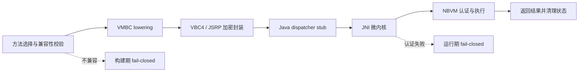

<p align="center">
  
</p>

<h1 align="center">JavaShroud</h1>

<p align="center">
  <strong>面向 Java 产物的混淆、虚拟化与 Native 加固工具链</strong>
</p>

<p align="center">
  
  
  
  
</p>
<p align="center">
  <strong>简体中文</strong> · <a href="README_EN.md">English</a>
</p>

## 项目定位

JavaShroud 将 Java 字节码变换、方法虚拟化、Native 微内核与桌面工作流整合为一套混淆和加固工具链。除重命名、字符串保护、控制流扰动等常规能力外，它还可将关键方法转换为 VMBC 资源，并交由 Native bytecode VM（NBVM）执行。

当前大版本为 `0.11`。

项目采用接近 Kerckhoffs 原则的设计：保护强度主要来自产物级密钥、结构差异、运行时认证和 Java / Native 执行边界，而不是依赖实现细节长期保密。自包含产物仍会携带执行所需材料，因此目标是提高分析和批量复用成本，而非宣称绝对不可逆。

## 核心能力

| 模块 | 代表能力 |
| --- | --- |
| 字节码混淆 | 类、包、方法、字段重命名，整数与字符串保护 |
| 控制流保护 | 控制流扰动、平坦化、引用代理、`invokedynamic` / `condy` 间接化 |
| 方法虚拟化 | JVM bytecode lowering 为 VBC4 / VMBC，由 Native VM 执行 |
| 资源保护 | JSRP 封装、分区加密、HMAC、切片、manifest 与差异化布局 |
| 运行时防护 | 完整性 gate、状态绑定、anti-instrumentation、anti-dump |
| Native 加固 | 认证外壳、内层 kernel 封装、平台 loader 与篡改 fail-closed |
| 桌面工作流 | Wails + Vue 图形界面、配置编辑与引擎任务管理 |

默认 pipeline 保持保守；强保护能力需根据兼容性和性能要求按需启用。

## VMBC / NBVM 执行链

`method-virtualization` 将选中的 Java 方法转换为 VBC4 / VMBC 资源。原方法体由轻量 dispatcher stub 替代，运行时经 `JniMicrokernelHelper.executeVmResource` 进入 JNI 微内核，并由 `js_vm_execute_resource` 对应的 Native VM 完成认证、解析、执行和敏感状态清理。


```mermaid
flowchart LR
  A["方法选择与兼容性校验"] --> B["VMBC lowering"]
  B --> C["VBC4 / JSRP 加密封装"]
  C --> D["Java dispatcher stub"]
  D --> E["JNI 微内核"]
  E --> F["NBVM 认证与执行"]
  F --> G["返回结果并清理状态"]
  A -.不兼容.-> X["构建期 fail-closed"]
  E -.认证失败.-> Y["运行期 fail-closed"]
```

这条链路使用产物级材料、入口 token、opcode dialect、资源路径、layout digest 和 Native profile 共同约束执行。未被选中或不兼容的方法仍属于普通字节码混淆边界。

## Native 加固

用户侧统一称为 **Native 加固**。配置项 `jni-microkernel-loader.nativePackingLevel` 保留 `off`、`standard`、`max` 三档，其中 `max` 是当前默认的高强度加固档：

- 外层 `js_kernel_<platform>` stub 由 `System.load` 直接加载，完整 inner kernel 以认证编码 payload 封装在外壳中。
- `JNI_OnLoad` 校验 header、section digest、布局与 dispatcher profile、payload binding、分块 tag 和 payload MAC。
- Java 层只加载外层 stub，不保留 Java 解包 fallback；资源、索引、profile 或外壳 metadata 被篡改时直接 fail-closed。
- Native kernel 与 VMBC 资源、bootstrap index、resource path 和 manifest mesh 绑定，降低跨产物直接替换与重放的可行性。

| 平台 | 当前加固边界 |
| --- | --- |
| Windows x64 | PE64 内存映射，覆盖 section、relocation、import / export、TLS、`DllMain`、`JNI_OnLoad` 与 ABI table 校验 |
| Linux x64 | 匿名内存 ELF64 loader，覆盖 `PT_LOAD` / `PT_DYNAMIC`、hash、symbol、RELA / PLT、initializer 与入口校验 |
| macOS x64 / arm64 | 外层 stub 与 Mach-O metadata、rebase / bind、export trie、initializer 校验；未满足匿名执行映射条件时 fail-closed |

## 与 JNIC / Native 混淆的区别

| 维度 | 常见 JNIC / Native 混淆 | JavaShroud VMBC / NBVM |
| --- | --- | --- |
| 转换目标 | Java 方法转为本地函数 | Java 方法转为 VMBC 资源 |
| 执行方式 | JNI 调用对应本地函数 | Native VM 认证、解析并调度虚拟指令 |
| 主要分析面 | JNI bridge、导出与机器码 | dispatcher、资源封装、虚拟 ISA、VM 状态与 Native 边界 |
| 差异化来源 | 本地编译结果 | 产物级密钥、布局、opcode、token 与 runtime profile |

两条路线并不互斥；JavaShroud 将 Native 层作为虚拟执行协议的一部分，而不仅是迁移代码的位置。

## 兼容性

- JavaShroud 引擎使用 JDK 21+ 构建和运行。
- 常规重命名、metadata 清理和多数基础混淆 pass 可处理 Java 8 classfile，且不应主动抬升版本。
- `ConstantDynamic` 相关能力要求 Java 11+；VMBC、Native loader 与大多数运行时保护面向 Java 11+ 目标运行时。
- Native 加固依赖目标平台、JNI 和本机构建链；正式交付前应以实际产物运行结果为准。

## 快速开始

```powershell
# 构建核心引擎
.\gradlew.bat :core-engine:jar

# 查看 CLI schema
java -jar build\core-engine\libs\obfuscator-engine.jar -schema

# 使用 TOML 配置处理 JAR
java -jar build\core-engine\libs\obfuscator-engine.jar -config path\to\config.toml
```

桌面端开发：

```powershell
corepack yarn --cwd desktop-app\frontend install --immutable
corepack yarn --cwd desktop-app\frontend build

Set-Location desktop-app
go build ./...
go test ./...
```

Windows 完整发布入口：

```powershell
.\build-release.bat
```

发布脚本会构建核心引擎、GraalVM native engine、前端资源和 Wails 桌面程序，输出目录为 `build\release\javashroud-windows-amd64\`。GitHub Release 由 `.github/workflows/release.yml` 在推送 `v*` 标签时构建和发布。

## 目录结构

```text
core-engine/          Kotlin / Java 引擎、VMBC 与 Native runtime
desktop-app/          Go / Wails 桌面宿主与 Vue 前端
annotations/          JavaShroud 注解模块
scripts/              验证与辅助脚本
assets/               README 与发布资源
build-release.bat     Windows 发布入口
```

## 许可证

JavaShroud 基于 [GNU GPL v3](LICENSE) 发布。第三方组件及 vendored 源码声明见 [THIRD_PARTY_NOTICES.md](THIRD_PARTY_NOTICES.md) 与 [NOTICE](NOTICE)。

## 致谢

- [Open-MyJ2c](https://github.com/MyJ2c/Open-MyJ2c)
- [native-obfuscator](https://github.com/radioegor146/native-obfuscator)
- [skidfuscator-java-obfuscator](https://github.com/skidfuscatordev/skidfuscator-java-obfuscator)
- [Tigress_protection](https://github.com/JonathanSalwan/Tigress_protection)
