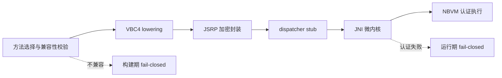

<p align="center">
  
</p>

<h1 align="center">JavaShroud</h1>

<p align="center">
  <strong>面向 Java 产物的混淆、虚拟化与 Native 加壳工具链</strong>
</p>

<p align="center">
  
  
  
  
</p>
<p align="center">
  <strong>简体中文</strong> · <a href="README_EN.md">English</a>
</p>

## 项目定位

JavaShroud 是一套 Java 混淆与加固工具链：Kotlin 引擎做字节码变换，选中的方法可以 lowering 成 VMBC 资源交给 Native bytecode VM（NBVM）执行，桌面端（Wails + Vue）负责配置编辑和任务管理。

设计取向接近 Kerckhoffs 原则：保护强度来自每份产物独立生成的密钥、布局、opcode 方言和 Java / Native 执行边界，不依赖实现细节长期保密。产物自带运行所需的全部材料，所以这里的目标是拉高分析和跨样本复用的成本，而不是宣称绝对不可逆。

## 核心能力

| 模块 | pass / 入口 |
| --- | --- |
| 重命名 | `rename-classes`、`rename-packages`、`rename-methods`、`rename-fields`（stable） |
| 常量与字符串 | `integer-constant-obfuscation`、`string-encryption`、`field-string-encryption` |
| 控制流 | `control-flow-obfuscation`、`control-flow-flattening`、`reference-proxy`、`invoke-dynamic-indirection`、`condy-constant-indirection` |
| 方法虚拟化 | `method-virtualization`：JVM bytecode lowering 为 VBC4，由 NBVM 执行 |
| 资源与类保护 | JSRP 当前格式认证资源封装、Native typed page 路由 |
| 运行时防御 | `os-anti-debug`、`os-anti-vm`、`callsite-rotation-protection`、`exception-semantic-virtualization` |
| Native runtime | `jni-microkernel-loader`：AKEN-R1 Rust runtime、认证资源与平台绑定 |
| 桌面工作流 | Wails + Vue 界面、配置编辑、引擎任务管理 |

注册 pass 共 26 个，默认 pipeline 只含 `strip-compile-debug-info`。stable pass 默认启用；experimental pass 需在配置里显式打开，其中带 opt-in 标记的还要求 `allowOptInPasses = true`。

## 控制流混淆

JavaShroud 的控制流保护分成两类：`control-flow-obfuscation` 改写现有分支和异常处理器周围的结构；`control-flow-flattening` 在方法中加入额外的分派块和干扰结构。`reference-proxy`、`invoke-dynamic-indirection` 与 `condy-constant-indirection` 则改变调用或常量的解析路径，可按需要与前两者一起使用。

`control-flow-obfuscation` 会在方法入口插入不透明谓词，并选择部分 `GOTO` 边包上一层等价分派。可选的谓词包括二次剩余、位运算恒等式和模运算；`mixed` 会在这些形式之间随机选择。跳转可改写为 `if-chain`、`lookupswitch` 或 `tableswitch-hybrid`。`density` 决定处理多少跳转，`frequency` 控制谓词插入频率，`seed` 用于复现同一组选择。

这个 pass 还有两项结构改写：

- `branchInjection` 把经过 frame 分析确认的空栈 `GOTO` 改成读取合成状态字段的条件边，提供 `light`、`normal`、`aggressive` 三档。
- `handlerSplit` 将满足条件的同类型纯重抛 handler 拆成重叠保护区和 relay，提供 `light`、`heavy` 两档。

`control-flow-flattening` 适合再加一层干扰。它按 `density` 选择处理位置，可使用 `arithmetic-nop`、`dead-branch`、`unreachable-method`、`field-noise` 四种分派块模式；handler 体可保持 `nop`，也可改为合成字段写入或合成方法调用。

### 强度怎么选

| 目标 | 建议组合 | 产物特点 |
| --- | --- | --- |
| 低干扰 | `control-flow-obfuscation`，`density = 3..5`，`if-chain` | 增加入口谓词和少量伪边，体积与调试影响较小。 |
| 常规保护 | `density = 6..8`，`algebraicFamily = "mixed"`，配合 `control-flow-flattening` | 同一方法内会混入多种谓词和分派块，反编译结果更零散。 |
| 高干扰 | `density = 9..10`，`tableswitch-hybrid` 或 `lookupswitch`，按兼容性开启 `branchInjection` / `handlerSplit` | 跳转图、异常表和局部分派结构变化更多；应重点测试异常路径、热点方法和启动时间。 |
| 高价值逻辑 | 控制流 pass 加调用间接、字符串/常量保护；必要时使用 `method-virtualization` | 普通字节码层之外还会改变调用解析或转入 VMBC / NBVM 执行。 |

这里的“强度”说的是静态阅读、CFG 还原和规则匹配的工作量，不是不可逆承诺。JVM 指令仍在产物中；恒等条件和死路径在足够时间下可以被化简。实际配置应从少量关键类开始，逐步扩大范围。

变换不会为了覆盖率硬改每个方法。构造器、接口、abstract / native 方法，以及包含 monitor、switch、未初始化对象或复杂异常表的高风险形状会被跳过。修改完成后会重算 StackMap frame，并重新分析已修改的方法。发布前请至少执行 `java -Xverify:all`、应用启动和关键业务回归。

## 资源封装：JSRP

JSRP 是项目内部的受保护资源封装格式（magic `JSRP`，当前版本 7）。VM 字节码、Native 库、manifest、bootstrap 索引统一经 `RuntimeResourceCodec` 封装：

- 结构为 27 字节 header + 96 字节加密 metadata + AES-CTR body + 32 字节 HMAC-SHA256 tag；metadata 与 body 的密钥、IV 由分区密钥经 HMAC 域分离派生。
- 密钥来自构建期 CSPRNG 生成的分区密钥表（`RuntimeKeyPartitions`），按资源分区选取；header、metadata、body 任何一处改动都会让 tag 校验失败。
- body 默认先经 zstd 压缩（`Vbc4ZstdCodec`）；metadata 记录原文与压缩后的 SHA-256，解码时逐级核对长度与哈希。

协议字段与解码流程见 `RuntimeResourceCodec`。

## VMBC / NBVM 执行链

`method-virtualization` 把选中的 Java 方法 lowering 成 VBC4 字节码（`VmBytecodeSerializer`），封装为 JSRP 资源；原方法体替换成 dispatcher stub。运行时 stub 调 `JniMicrokernelHelper.executeVmResource(entryToken, …)` 进入 JNI 微内核，由 `js_vm_execute_resource` 对应的 Native VM 完成资源认证、解析、执行和敏感状态清理。


```mermaid
flowchart LR
  A["方法选择与兼容性校验"] --> B["VBC4 lowering"]
  B --> C["JSRP 加密封装"]
  C --> D["dispatcher stub"]
  D --> E["JNI 微内核"]
  E --> F["NBVM 认证执行"]
  A -.不兼容.-> X["构建期 fail-closed"]
  E -.认证失败.-> Y["运行期 fail-closed"]
```

执行入口由每产物的 entry token、opcode 方言、资源路径、layout digest 和 dispatcher profile（`DispatcherProfile`）共同约束。未被选中或不兼容的方法留在普通字节码混淆边界内。

## Native 加固

AKEN-R1 使用 Rust-only runtime 边界与最终认证 Native locator：

- 生产资源只为 Windows x64 与 Linux x64 选择，并绑定最终 artifact digest 与当前 runtime 格式。
- 资源、平台、长度、镜像和 binding 任一校验失败都会拒绝加载；Java 不回退到旧 C shell 或系统路径库。
- 旧 `NativeKernelShellPacker` C 外壳、Mach-O loader、Zig 入口和 `.dylib` 输出均已退役，只为 stale source fixture 保留 fail-closed 封存。

### 平台边界

| 平台 | AKEN-R1 当前 Native 边界 |
| --- | --- |
| Windows x64 | Rust runtime，唯一 cargo target 为 `x86_64-pc-windows-gnu`，资源后缀为 `.dll`；PE/旧 C loader 不再是生产路径 |
| Linux x64 | Rust runtime，唯一 cargo target 为 `x86_64-unknown-linux-gnu.2.17`，资源后缀为 `.so`；ELF/旧 C loader 不再是生产路径 |
| 其他平台 | 包括 macOS、Mach-O 与 `.dylib`：平台识别、构建、资源选择和加载均 fail-closed |

AKEN-R1 不再编译、打包或运行旧 C/Zig Native runtime；旧 build/cache/temp 入口只保留 fail-closed 封存脚本。

## 与 JNIC / Native 混淆的区别

| 维度 | 常见 JNIC / Native 混淆 | JavaShroud VMBC / NBVM |
| --- | --- | --- |
| 转换目标 | Java 方法转为本地函数 | Java 方法转为 VMBC 资源 |
| 执行方式 | JNI 调用对应本地函数 | Native VM 认证、解析并调度虚拟指令 |
| 主要分析面 | JNI bridge、导出与机器码 | dispatcher、资源封装、虚拟 ISA、VM 状态与 Native 边界 |
| 差异化来源 | 本地编译结果 | 每产物密钥、布局、opcode、token 与 runtime profile |

两条路线不互斥；JavaShroud 的 Native 层是虚拟执行协议的一部分，不只是迁移代码的位置。

## 兼容性

- JavaShroud 引擎本身用 JDK 21+ 构建和运行。
- 重命名、metadata 清理和多数基础 pass 可处理 Java 8 classfile，不会主动抬升 classfile 版本。
- `ConstantDynamic` 相关能力要求 Java 11+；VMBC、Rust Native runtime 与多数运行时防护面向 Java 11+ 目标运行时。
- Native runtime 只接受 AKEN-R1 声明的 Windows/Linux x64 target；正式交付前以实际产物的 digest、locator 和运行结果为准。

## 快速开始

```powershell
# 构建核心引擎
.\gradlew.bat :core-engine:jar

# 查看 CLI schema（pass 清单、参数、默认 pipeline）
java -jar build\core-engine\libs\obfuscator-engine-0.12.jar -schema

# 用 TOML 配置处理 JAR
java -jar build\core-engine\libs\obfuscator-engine-0.12.jar -config path\to\config.toml
```

最小配置示例：

```toml
inputJarPath = "app.jar"
outputJarPath = "app-obf.jar"
allowOptInPasses = true

[[passes]]
id = "rename-classes"
enabled = true

[[passes]]
id = "control-flow-flattening"
enabled = true

[ruleSet]
[[ruleSet.rules]]
target = "class **"
action = "obfuscate"

[[ruleSet.rules]]
target = "class com.example.api.**"
action = "exclude"
```

桌面端开发：

```powershell
corepack yarn --cwd desktop-app\frontend install --immutable
corepack yarn --cwd desktop-app\frontend build

Set-Location desktop-app
go build ./...
go test ./...
```

Windows 完整发布入口：

```powershell
.\build-release.bat
```

发布脚本构建核心引擎、GraalVM native engine、前端资源和 Wails 桌面程序，输出到 `build\release\javashroud-windows-amd64\`。GitHub Release 由 `.github/workflows/release.yml` 在推送 `v*` 标签时构建和发布。

## 目录结构

```text
core-engine/          Kotlin / Java 引擎、VMBC 与 Native runtime
desktop-app/          Go / Wails 桌面宿主与 Vue 前端
annotations/          JavaShroud 注解模块
assets/               README 与发布资源
build-release.bat     Windows 发布入口
```

## 许可证

JavaShroud 基于 [GNU GPL v3](LICENSE) 发布。第三方组件及 vendored 源码声明见 [THIRD_PARTY_NOTICES.md](THIRD_PARTY_NOTICES.md) 与 [NOTICE](NOTICE)。

## 致谢

- [Open-MyJ2c](https://github.com/MyJ2c/Open-MyJ2c)
- [native-obfuscator](https://github.com/radioegor146/native-obfuscator)
- [skidfuscator-java-obfuscator](https://github.com/skidfuscatordev/skidfuscator-java-obfuscator)
- [Tigress_protection](https://github.com/JonathanSalwan/Tigress_protection)
