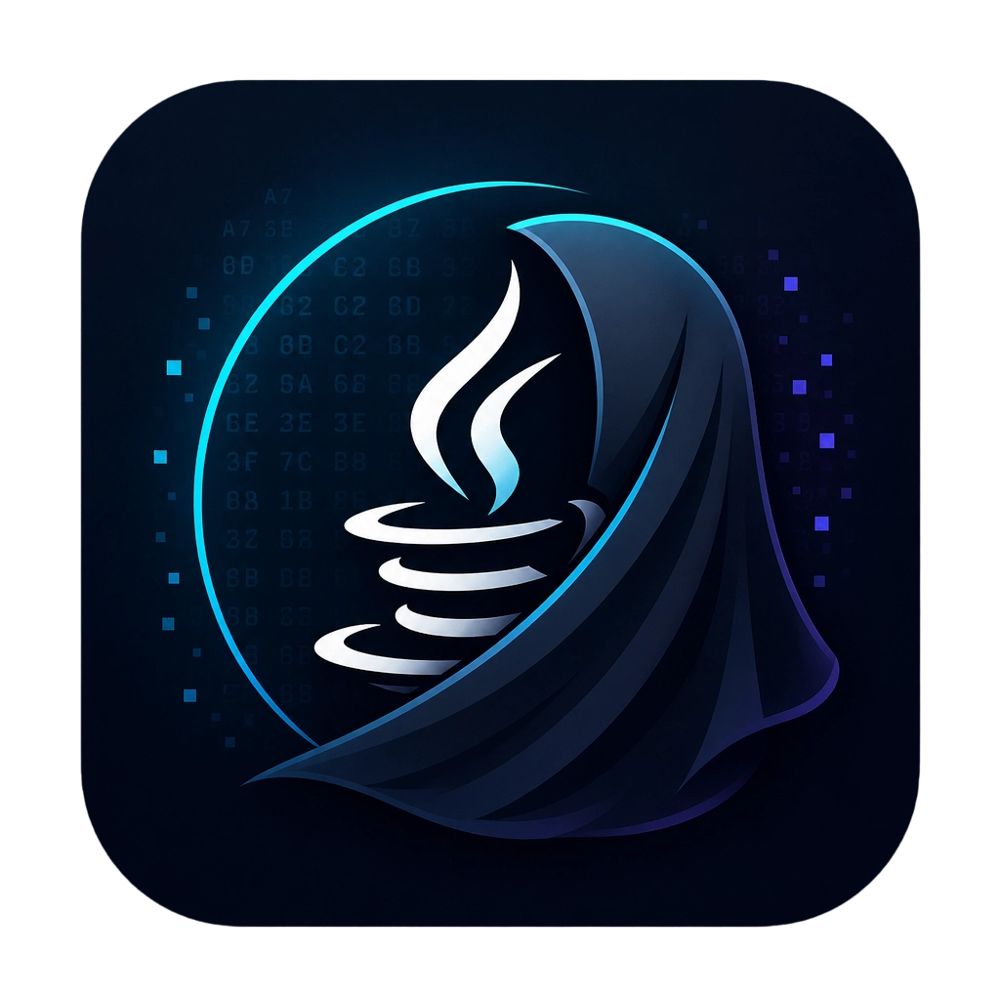
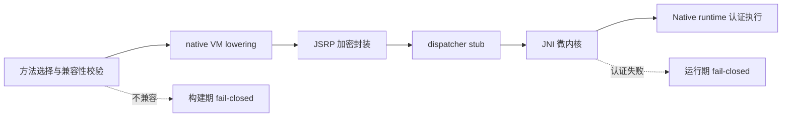

<p align="center">
  
</p>

<h1 align="center">JavaShroud</h1>

<p align="center">
  <strong>面向 Java 产物的混淆、虚拟化与 Native 加壳工具链</strong>
</p>

<p align="center">
  
  
  
  
</p>
<p align="center">
  <strong>简体中文</strong> · <a href="README_EN.md">English</a>
</p>

## 项目定位

JavaShroud 是一套 Java 混淆与加固工具链：Kotlin 引擎做字节码变换，选中的方法 lowering 为受保护资源并交给 Native runtime 执行，Wails + Vue 桌面端负责配置编辑、类树浏览与任务管理。设计取向贴近 Kerckhoffs 原则——强度来自每份产物独立生成的密钥、布局、opcode 方言和 Java / Native 执行边界，实现细节公开不会削弱单份产物的保护。

构建期为每份产物生成专属材料：6–16 个资源分区密钥加一个锚密钥、256 位 opcode 方言承诺、页密钥槽位，以及 native locator 路由与绑定摘要。同一份输入在不同构建里得到不同的密钥布局、方言掩码和 native digest，运行行为保持一致。产物自带运行所需的全部材料，分析者面对的是一份自洽的加密容器和一个只认这份容器的 native 内核。

在字节码变换与 Native runtime 之外，编译出的 native 镜像还可交由 [Xenolith](https://github.com/HHT0rro/Xenolith)——一个独立开源的 PE 加壳器——做镜像级加壳，形成字节码混淆、方法虚拟化、Native runtime、镜像加壳的完整保护链。

## 核心能力

| 模块 | pass / 入口 |
| --- | --- |
| 重命名 | `rename-classes`、`rename-packages`、`rename-methods`、`rename-fields` |
| 常量与字符串 | `integer-constant-obfuscation`、`string-encryption`、`field-string-encryption` |
| 控制流 | `control-flow-obfuscation`、`control-flow-flattening`、`reference-proxy`、`invoke-dynamic-indirection`、`condy-constant-indirection` |
| 元数据与结构 | `strip-compile-debug-info`、`member-shuffle`、`member-hide`、`static-init-perturbation`、`anti-decompiler-structure` |
| 方法虚拟化 | `method-virtualization`：JVM bytecode lowering 为 native VM 字节码，由 Native dispatcher 执行 |
| 资源与类保护 | JSRP v8 认证资源封装、Native typed page 路由 |
| 运行时防御 | `os-anti-debug`、`os-anti-vm`、`callsite-rotation-protection`、`exception-semantic-virtualization` |
| Native runtime | `jni-microkernel-loader`：Qp Rust runtime、认证资源与平台绑定 |
| Native 加壳 | `nativeshroud`：Xenolith 自动加壳（`fast` / `standard` / `max` 档位）、预打包镜像挂载、桌面加壳交接 |
| 桌面工作流 | Wails + Vue 界面、配置编辑、类树与方法选择、任务运行与事件日志 |

引擎注册 24 个 pass。`-schema` 报告的默认 pipeline 只含 `strip-compile-debug-info`；配置里写 `protectionProfile = "release-hardened"` 且 `passes` 为空时，引擎展开 13 个 pass 的加固流水线：

```text
rename-packages, rename-classes, rename-methods, rename-fields, string-encryption,
invoke-dynamic-indirection, callsite-rotation-protection, jni-microkernel-loader,
os-anti-debug, os-anti-vm, method-virtualization, strip-compile-debug-info,
control-flow-flattening
```

配置校验在运行前完成：`requiredPassIds` 自动补齐，`requiresAnyPassIds` 必须由配置满足，schema 里 `requiresOptIn = true` 或 `risk = high` 的 pass 需要 `allowOptInPasses = true`。不合规的组合直接报错退出，不降级执行。

## 控制流混淆

`control-flow-obfuscation` 改写既有分支和异常处理器周围的结构，`control-flow-flattening` 追加分派块与干扰结构，`reference-proxy`、`invoke-dynamic-indirection`、`condy-constant-indirection` 改变调用或常量的解析路径。三类可自由组合。

`control-flow-obfuscation` 在方法入口插入不透明谓词，并按 `density` 选择 `GOTO` 边包一层等价分派：

| 参数 | 取值 | 作用 |
| --- | --- | --- |
| `density` | 1–10，默认 5 | 每条 `GOTO` 被改写的概率：1 约为 1/10，10 全量改写 |
| `dispatchMode` | `if-chain`（默认）、`lookupswitch`、`tableswitch-hybrid`、`mixed` | 等价分派的指令形态 |
| `algebraicFamily` | `quadratic-residue`、`bitwise-identity`、`modular-arithmetic`、`mixed`（默认） | 不透明谓词的代数族 |
| `branchInjection` | `none`（默认）、`light`、`normal`、`aggressive` | 把经 frame 分析确认空栈的 `GOTO` 改写为读取合成状态字段的条件边 |
| `handlerSplit` | `none`（默认）、`light`、`heavy` | 把纯重抛 handler 拆成重叠保护区和 relay |

改写范围由方法结构决定：

- 谓词与分派改写跳过接口、`<clinit>`、abstract / native 方法和指令数少于 2 的方法。
- `branchInjection` 只处理源帧与目标帧都为空栈的 `GOTO`，并跳过 `<init>`、`<clinit>`、带异常处理器的方法，以及含 monitor、`NEW`、`JSR` / `RET`、`tableswitch` / `lookupswitch` 的方法。
- `handlerSplit` 要求方法没有分支、只有一个带类型的 handler，且 handler 体是 `ASTORE` / `ALOAD` / `ATHROW` 三段纯重抛。

`control-flow-flattening` 的参数是 `density`（1–10，默认 5）、`pattern`（`arithmetic-nop`、`dead-branch`（默认）、`unreachable-method`、`field-noise`）与 `handlerComplexity`（`nop`（默认）、`field-write`、`method-call`）；它跳过构造器、`<clinit>`、monitor 深度不守恒的 `GOTO` 边，以及跳进 handler 的边。

### 强度怎么选

| 目标 | 建议组合 | 产物特点 |
| --- | --- | --- |
| 低干扰 | `control-flow-obfuscation`，`density = 3..5`，`dispatchMode = "if-chain"` | 入口谓词加少量伪边，体积与调试影响可控 |
| 常规保护 | `density = 6..8`，`algebraicFamily = "mixed"`，叠加 `control-flow-flattening` | 同一方法内混入多种谓词和分派块，反编译结果零散 |
| 高干扰 | `density = 9..10`，`tableswitch-hybrid` 或 `lookupswitch`，按兼容性打开 `branchInjection` / `handlerSplit` | 跳转图、异常表和局部分派结构明显改变；异常路径、热点方法与启动时间需要单独测 |
| 高价值逻辑 | 控制流 pass 加调用 / 常量间接，必要时启用 `method-virtualization` | 普通字节码层之外还有调用解析改写与 Native VM 执行 |

强度对应静态阅读、CFG 还原和规则匹配的工作量。输出仍是标准 JVM 指令：恒等条件和死路径在足够时间下可被化简，异常表和帧信息也必须保持自洽才能通过验证器。配置从少量关键类开始，逐步扩大范围。

变换后的类会重算 StackMap frame 并重新分析；发布前跑一遍 `java -Xverify:all`、应用启动和关键业务回归。

## 资源封装：JSRP

JSRP 是项目内部的受保护资源格式（magic `JSRP`，当前版本 8）。VM 字节码、Native 库、manifest 和 bootstrap 索引统一经 `QpResourceCodec` 封装：

- 结构为 27 字节 header + 96 字节加密 metadata + AES-CTR body + 32 字节 HMAC-SHA256 tag；metadata 与 body 的密钥、IV 由分区密钥经 HMAC 域分离派生。
- 密钥来自构建期 CSPRNG 生成的 `RuntimeKeyPartitions`：6–16 个资源分区密钥加一个锚密钥，每个资源按身份摘要稳定映射到分区槽位。
- header、metadata、body 任何一处改动都会让 tag 校验失败；解码时逐级核对长度、`storedHash` 与 `plainHash`。
- body 默认先经 zstd 压缩（`QpCompressionCodec`），metadata 同时记录原文与压缩后内容的 SHA-256。

字段布局与解码流程见 `QpResourceCodec`。

## 方法虚拟化执行链

`method-virtualization` 把选中的 Java 方法 lowering 成 native VM 字节码（`QpSerializer`），按 JSRP 封装为资源，原方法体替换成 dispatcher stub。运行时 stub 调 `QpBridge.executeQpVmPage(sealedEntryToken, encodedHandle, pageIndex, callSiteProof, args)` 进入 JNI 微内核，由 Rust 侧完成资源认证、页面打开、指令执行和敏感状态清理；字符串走 `QpBridge.openQpString`，类页走 `readQpClassPage`。


```mermaid
flowchart LR
  A["方法选择与兼容性校验"] --> B["native VM lowering"]
  B --> C["JSRP 加密封装"]
  C --> D["dispatcher stub"]
  D --> E["JNI 微内核"]
  E --> F["Native runtime 认证执行"]
  A -.不兼容.-> X["构建期 fail-closed"]
  E -.认证失败.-> Y["运行期 fail-closed"]
```

执行入口由每产物的 entry token、opcode 方言、资源路径、layout digest 和 dispatcher profile 共同约束。dispatcher profile 在 `SWITCH`、`DIRECT_THREADED`、`INDIRECT_THREADED`、`CALL_THREADED`、`IF_NEST`、`INTERPOLATION` 六种形态中按 entry token、资源路径与 manifest mesh 选出。方法选择支持 `safe`、`critical-auto`、`critical-plus`（默认）、`all-compatible` 四种策略，显式成员规则优先，`maxInstructions` 与 `maxBroadVirtualizedMethods` 控制规模上限。构建期判定不兼容的方法留在字节码混淆边界内。

## Native 加固

Qp runtime 是 Rust-only 边界，源码随引擎分发在 `core-engine/src/main/rust`，由 `qp-crypto`、`qp-page`、`qp-vm`、`qp-ffi`、`qp-resource`、`qp-runtime`、`qp-shell` 七个 crate 组成。

- 生产资源只为 Windows x64 与 Linux x64 生成，并绑定最终 artifact digest 与当前 runtime 格式；工具链锁定 Rust 1.78、Zig 0.13.0、cargo-zigbuild 0.23.2，Linux glibc floor 2.17。
- 资源、平台、长度、镜像头和 binding 任一校验失败都会拒绝加载；Java 侧不会回退到旧 C shell 或系统路径库。
- 编译出的 native 镜像可再经 `nativeshroud` 做外部加壳（Xenolith 自动打包 / 预打包镜像 / 桌面交接，均 fail-closed），详见下节「Native 加壳：Xenolith」。
- 旧 `NativeKernelShellPacker` C 外壳、Mach-O loader、Zig 入口和 `.dylib` 输出均已退役，只为 stale source fixture 保留 fail-closed 封存。

### 平台边界

| 平台 | Qp 当前 Native 边界 |
| --- | --- |
| Windows x64 | Rust runtime，cargo target `x86_64-pc-windows-gnu`，资源后缀 `.dll`；PE loader 与旧 C 路径不在生产路径 |
| Linux x64 | Rust runtime，cargo target `x86_64-unknown-linux-gnu.2.17`，资源后缀 `.so`；ELF loader 与旧 C 路径不在生产路径 |
| 其他平台 | 含 macOS、Mach-O 与 `.dylib`：平台识别、构建、资源选择和加载全部 fail-closed |

## Native 加壳：Xenolith

`nativeshroud` 负责给编译出的 native 镜像（Windows x64 上的 `qp_ffi.dll`）做外部加壳，默认路径是 [Xenolith](https://github.com/HHT0rro/Xenolith)——一个独立开源的 Windows x64 PE 加壳器（GPL-3.0）。JavaShroud 只 spawn 其 CLI（`xenolith pack <qp_ffi.dll> -o <out> --profile <p> --json`），不链接其代码；加壳发生在 JSIM 绑定之前，打包失败、镜像缺失或用户取消一律 fail-closed，直接拒绝发运。

### 档位与函数级开关

| 参数 | 取值 | 作用 |
| --- | --- | --- |
| `profile` | `fast`、`standard`（默认）、`max` | 打包档位：fast 最快，standard 均衡，max 附加反调试探测 |
| `vmExports` | 导出名列表 | 透传 `--vm-export` 做函数级虚拟化；JVM/CRT ABI 名与 fast 档位被引擎侧 fail-fast 拒绝 |
| `selectRva` / `selectFunction` | 可重复 | 透传 `--select-rva` / `--select-function` 做函数级选择 |
| `selectAll` / `strictCoverage` / `allowNativeFallback` | 布尔 | 全量选择与覆盖度控制；`selectAll` 与 `allowNativeFallback` 互斥 |
| `protectImports` / `strictConstants` / `traceDiverge` | 布尔 | 导入保护、常量保护与 diverge 追踪 |

`lazyRegions` 已验证与 qp_ffi 的 JNI 宿主引导不兼容（VEH 唤醒无法在加载器锁下运行，DLL 初始化例程必然失败），引擎侧具名拒绝。

### 桌面与构建集成

- 桌面版把 Xenolith CLI 内嵌进 `javashroud.exe`（构建标签 `javashroud_embed_xenolith`）并随包附带 `tools\xenolith.exe`，在"自定义加壳"模块一键开启；默认即内置 CLI 自动打包，也可暂停等待手动加壳（VMP 等）再选回文件。
- 发布包构建时找不到本地 xenolith.exe，`build-release.bat` 会调 `desktop-app\fetch-xenolith.ps1` 从 GitHub Releases 自动获取（跳过无 Windows 资产的 tag），优先国内镜像链 `ghfast.top` → `gh-proxy.com` → `ghproxy.net`、直连兜底，并按发布包内 `manifest.json` 的逐工件 SHA-256 校验通过后才原子写入。可用环境变量覆盖：`XENOLITH_MIRRORS`（分号分隔的镜像前缀，`-` 表示禁用镜像）、`XENOLITH_RELEASE_TAG`（固定 release tag）、`XENOLITH_SHA256`（硬钉摘要，不匹配即失败）。

### 加壳镜像契约

无论镜像来自 Xenolith、VMP 还是其他加壳器，进入 JSIM 绑定前都要过同一道预校验：必须是 PE64 DLL，保留 `.jsms` / `.jsmk` 测量段与 `JNI_OnLoad` / `JNI_OnUnload` / `qp_r1_*` 导出，否则被具名拒绝。不使用 CLI 的场景还有两条路：`packedPath` / `packedPathLinux` 直接指向预打包镜像；`JAVASHROUD_PACK_HANDOFF=1` 时引擎发出 `need-pack` 事件并等待路径回传，Linux 可回 `SKIP` 直接发运未加壳 `.so`。

## 与 JNIC / Native 混淆的区别

| 维度 | 常见 JNIC / Native 混淆 | JavaShroud 方法虚拟化 |
| --- | --- | --- |
| 转换目标 | Java 方法转为本地函数 | Java 方法转为受保护的 Native VM 资源 |
| 执行方式 | JNI 调用对应本地函数 | Native VM 认证、解析并调度虚拟指令 |
| 主要分析面 | JNI bridge、导出表与机器码 | dispatcher、资源封装、虚拟 ISA、VM 状态与 Native 边界 |
| 差异化来源 | 本地编译结果 | 每产物密钥、布局、opcode、token 与 runtime profile |

两条路线可以并存；JavaShroud 的 Native 层是虚拟执行协议的一部分。

## 兼容性

- 引擎用 JDK 17+ 构建和运行，CI 在 JDK 17 与 21 上构建并测试。
- 重命名、metadata 清理和多数基础 pass 处理 Java 8 classfile，不抬升输入 major version。
- `condy-constant-indirection` 依赖 `CONSTANT_Dynamic`，要求 Java 11+ classfile。
- 方法虚拟化、Rust Native runtime 和运行时防护面向 Java 11+ 运行目标；native 资源只接受 Windows x64 与 Linux x64。

## 快速开始

```powershell
# 构建核心引擎（产物：build\core-engine\libs\obfuscator-engine-0.31.0.jar）
.\gradlew.bat :core-engine:jar

# 查看 pass 清单、参数、默认 pipeline 与兼容性约束（TOML 输出）
java -jar build\core-engine\libs\obfuscator-engine-0.31.0.jar -schema

# 查看输入 JAR 的包 / 类 / 成员树
java -jar build\core-engine\libs\obfuscator-engine-0.31.0.jar -inspect app.jar

# 按 TOML 配置处理 JAR
java -jar build\core-engine\libs\obfuscator-engine-0.31.0.jar -config path\to\config.toml

# 引擎运行时缓存维护
java -jar build\core-engine\libs\obfuscator-engine-0.31.0.jar -gc
java -jar build\core-engine\libs\obfuscator-engine-0.31.0.jar -gc --apply
```

配置示例（重命名 + 控制流平坦化；opt-in pass 需要 `allowOptInPasses = true`）：

```toml
inputJarPath = "app.jar"
outputJarPath = "app-obf.jar"
allowOptInPasses = true

[[passes]]
id = "rename-classes"
enabled = true

[[passes]]
id = "control-flow-flattening"
enabled = true

[ruleSet]
[[ruleSet.rules]]
target = "class **"
action = "obfuscate"

[[ruleSet.rules]]
target = "class com.example.api.**"
action = "exclude"
```

桌面端：

```powershell
corepack yarn --cwd desktop-app\frontend install --immutable
corepack yarn --cwd desktop-app\frontend build

Set-Location desktop-app
go build ./...
go test ./...
```

Windows 完整发布：

```powershell
.\build-release.bat
```

发布脚本构建核心引擎、GraalVM native engine、前端资源和 Wails 桌面程序，输出到 `build\release\javashroud-windows-amd64\`。推送 `v*` 标签时，`.github/workflows/release.yml` 构建并发布 GitHub Release。

## 目录结构

```text
core-engine/          Kotlin / Java 引擎、方法虚拟化与 Rust Native runtime
desktop-app/          Go / Wails 桌面宿主与 Vue 前端
annotations/          JavaShroud 注解模块
assets/               README 与发布资源
build-release.bat     Windows 发布入口
```

## 许可证

JavaShroud 基于 [GNU GPL v3](LICENSE) 发布。第三方组件及 vendored 源码声明见 [THIRD_PARTY_NOTICES.md](THIRD_PARTY_NOTICES.md) 与 [NOTICE](NOTICE)。

## 致谢

- [Open-MyJ2c](https://github.com/MyJ2c/Open-MyJ2c)
- [native-obfuscator](https://github.com/radioegor146/native-obfuscator)
- [skidfuscator-java-obfuscator](https://github.com/skidfuscatordev/skidfuscator-java-obfuscator)
- [Tigress_protection](https://github.com/JonathanSalwan/Tigress_protection)
