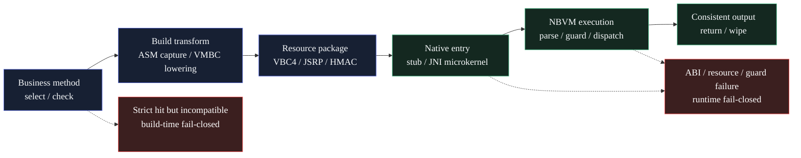

<p align="center">
  
</p>

<h1 align="center">JavaShroud</h1>

<p align="center">
  <strong>A Java obfuscation, virtualization, and native hardening toolchain</strong>
</p>

<p align="center">
  
  
  
</p>

<p align="center">
  <a href="README.md">简体中文</a> · <strong>English</strong>
</p>

## Positioning

JavaShroud is a Java obfuscation and hardening project built around bytecode transformation, method virtualization, a native microkernel, and a desktop workflow. It includes conventional Java obfuscation capabilities such as renaming, string protection, control-flow transformation, and metadata cleanup, while also providing a VMBC / NBVM (native bytecode VM) execution path for high-value methods.

The project follows a Kerckhoffs-oriented design philosophy: protection strength should not rely on the permanent secrecy of the implementation. It should instead come from per-artifact key material, structural diversity, runtime authentication, context binding, and the execution boundary between Java and Native code.

JavaShroud protects self-contained deliverables. Key material, runtime logic, and protected code must eventually ship with the artifact, so it cannot fully match the security model of online services, HSM-backed designs, or external authorization systems. The practical goal is not to claim irreversibility; it is to reduce the value of a universal deobfuscation template and raise the cost of targeted recovery, batch analysis, and automated reuse.

## VMBC And Native Execution

In JavaShroud, VMBC / NBVM refers to one code path: `method-virtualization` converts selected Java methods into VBC4 / VMBC resources, `JniMicrokernelHelper.executeVmResource` enters the native dispatcher, and execution continues in the native bytecode VM path represented by `js_vm_execute_resource`. In this repository, NBVM is shorthand for that native bytecode VM execution path rather than a separate subproject.

The core value of this path is that the original method body leaves the ordinary Java bytecode form. Key semantics are moved into an execution protocol constrained by authenticated resources, entry tokens, opcode dialects, constant-pool handling, block dispatch, and native runtime state.

Implemented mechanisms include:

| Layer | Mechanism | Purpose |
| --- | --- | --- |
| Method virtualization | VBC4-only, native-only, strict virtualization, entry token, dispatcher stub | Prevents the original method body from remaining as directly decompilable Java bytecode |
| VMBC encoding | Opcode aliases, super-operator folding, block split / coalesce, exception masking | Reduces stable one-to-one recovery of opcodes, control flow, and exception edges |
| Resource protection | JSRP envelope, AES/CTR, HMAC, nonce, zstd section, decoy / slice / opaque path | Raises the cost of offline enumeration, extraction, and replay of VMBC resources |
| Keys and state | Per-build / per-method material, state-bound seed unwrap, runtime resource key, layout digest | Prevents the public algorithm from directly becoming a cross-sample unpacking script |
| Native runtime | JNI microkernel, native VM parser / executor, register IR, lazy CP decrypt, resident masking, wipe | Shortens plaintext windows and moves the analysis surface across JVM and Native boundaries |
| Runtime defense | Anti-instrumentation, anti-dump, anti-JVMTI / agent checks, trampoline checks, integrity gates | Adds friction against common hooks, instrumentation, dumps, and replacement loading |

### VMBC / NBVM Flow



These capabilities have clear boundaries: `method-virtualization` only protects selected and compatible methods. Methods that are not virtualized remain ordinary bytecode-obfuscation targets. A self-contained artifact still contains the material required for execution, so a sufficiently privileged and targeted reverse-engineering effort can continue layer by layer. JavaShroud focuses on engineering cost increase, not absolute resistance to analysis.

## Compared With JNIC / Native Obfuscation

Traditional JNIC or Native obfuscation usually converts Java methods into C/C++ code and calls the resulting native functions through JNI. Its primary protection boundary is migration from Java to Native: less logic is exposed in the Java layer, and the attacker must analyze local libraries, symbols, exported functions, and machine code.

JavaShroud's VMBC path is closer to a virtual execution model. The Native layer is not merely a container for translated method functions; it participates in resource authentication, VMBC parsing, instruction dispatch, state binding, and runtime validation. Even after entering the Native layer, the attacker faces a protocol spanning Java stubs, VMBC resources, the JNI microkernel, and native VM state, rather than a single native function that maps directly back to the original Java method.

| Dimension | JNIC / Native obfuscation | JavaShroud VMBC / NBVM path |
| --- | --- | --- |
| Core idea | Move Java methods into Native functions | Convert method semantics into VMBC resources executed by a native VM |
| Main analysis target | JNI bridge, exported functions, machine code, symbol recovery | Dispatcher stub, resource envelope, virtual instructions, interpreter state, Native boundary |
| Risk after open sourcing | Fixed conversion templates and JNI shapes may be pattern-matched | Implementation can be studied, but each artifact still requires material/layout/runtime adaptation |
| Dynamic observation challenge | Hook JNI or native function parameters / return values | Recover VM state, instruction semantics, key derivation, and dispatch path together |
| Engineering tradeoff | Suitable for moving a small set of key methods to Native code | Suitable for systematic virtualization and diversified protection of high-value Java logic |

The two approaches are not mutually exclusive. JavaShroud adds a VM protocol and artifact-specific instantiation layer over the Native boundary, making Native code part of the execution model rather than only a place to hide translated code.

## General Capabilities

Beyond the VMBC / native VM path, JavaShroud currently exposes 26 executable pass bindings:

| Module | Representative capabilities |
| --- | --- |
| Metadata | Compile debug info, line number, local variable, and source metadata cleanup |
| Renaming | Class, package, method, and field renaming |
| Encryption | String encryption and field string encryption |
| Obfuscation | Integer constant obfuscation, static initializer perturbation, anti-decompiler structure, invokedynamic indirection, control-flow obfuscation, reference proxy, control-flow flattening, condy constant indirection |
| Loader protection | Class encryption loader and method body delayed decryption |
| Runtime defense | Callsite rotation, environment-bound keys, anti-symbolic execution, exception semantic virtualization |
| Native kernel | Anti-instrumentation, anti-dump, JNI microkernel loader |

The default pipeline stays conservative. High-risk capabilities are disabled by default and must be selected explicitly in rules. Strong protection passes can affect compatibility, performance, and debugging, so they should be applied to authorized protection scenarios and carefully selected classes or methods.

## Technology Stack

| Layer | Technology |
| --- | --- |
| Core engine | Kotlin 2.1, JDK 21, ASM 9.9, Jackson TOML, Gradle |
| Native runtime | C11, JNI, Zig / MSVC toolchain, vendored zstd decompression sources |
| Desktop host | Go, Wails v2, WebView2 |
| Frontend | Vue 3, Vite, TypeScript, Naive UI, lucide-vue-next, xterm, Tailwind CSS |
| Tests | Kotlin test / JUnit Platform, Go test, frontend parser check scripts |

## Common Commands

### Core Engine

```powershell
# Build the core engine JAR
.\gradlew.bat :core-engine:jar

# Run core engine tests
.\gradlew.bat :core-engine:test

# Inspect the engine schema
java -jar build\core-engine\libs\obfuscator-engine.jar -schema

# Process a JAR with a config file; use the actual CLI schema as the authority
java -jar build\core-engine\libs\obfuscator-engine.jar -config path\to\config.toml
```

### Desktop Frontend

```powershell
# Install frontend dependencies
corepack yarn --cwd desktop-app\frontend install --immutable

# Build the Vue / Vite frontend
corepack yarn --cwd desktop-app\frontend build

# Run frontend parser checks
corepack yarn --cwd desktop-app\frontend check:capabilities
corepack yarn --cwd desktop-app\frontend check:events
```

### Desktop Host

```powershell
# Validate Go / Wails-side code
Set-Location desktop-app
go build ./...
go test ./...

# Build with Wails; requires the Wails CLI to be installed
wails build
```

### Windows Release

```powershell
# Full release entrypoint
.\build-release.bat
```

The full release script builds the engine JAR, the GraalVM native engine, the frontend bundle, and the Wails desktop application. Release acceptance should be based on the expected artifacts, such as `build\release\javashroud-windows-amd64\javashroud.exe`, existing and running successfully, not only on individual Gradle, Yarn, or Go commands returning success.

## Repository Layout

```text
.
├─ core-engine/                 # Kotlin/Java core obfuscation engine
│  ├─ src/main/kotlin/          # passes, schema, artifact handling, VMBC, runtime resources
│  ├─ src/main/java/            # runtime helpers, including JNI microkernel and protection helpers
│  ├─ src/main/native/          # C/JNI native runtime, VM executor, anti-debug, vendored zstd sources
│  └─ src/test/kotlin/          # engine, pass, VMBC, native, and regression tests
├─ desktop-app/                 # Wails desktop host
│  ├─ frontend/                 # Vue 3 + Vite + TypeScript frontend
│  ├─ *.go                      # Go/Wails backend, engine process bridge, event bridge
│  └─ wails.json                # Wails configuration
├─ gradle/                      # Gradle wrapper
├─ assets/                      # README and release presentation assets
├─ build-release.bat            # Windows release entrypoint
├─ LICENSE                      # GPLv3 license text
├─ THIRD_PARTY_NOTICES.md       # Third-party notices
└─ SECURITY.md                  # Security and authorized-use notes
```

## License And Third-Party Components

This repository includes the GNU General Public License Version 3 text in `LICENSE`; the repository license should be treated according to that file. Use, modification, and redistribution of this project or derivative works must comply with GPLv3 requirements, including source availability, preservation of copyright notices, and compatible licensing of derivative works.

The project also depends on or vendors third-party components. In particular, `core-engine/src/main/native/zstd/` vendors Zstandard decompression sources, and `THIRD_PARTY_NOTICES.md` / `NOTICE` state that JavaShroud uses the BSD-style license option for those vendored files. ASM, Jackson, Kotlin, Gradle, JUnit, Wails, Vue, Vite, TypeScript, Naive UI, lucide, xterm, and Go dependencies remain under their respective upstream licenses. Binary or source redistribution should preserve the corresponding copyright notices, license texts, and notices.

## Acknowledgements

JavaShroud's design and implementation were informed by many open-source obfuscation, virtualization, and native protection projects. Without the engineering experience accumulated by these projects, JavaShroud would not have its current direction.

- [Open-MyJ2c](https://github.com/MyJ2c/Open-MyJ2c)
- [native-obfuscator](https://github.com/radioegor146/native-obfuscator)
- [skidfuscator-java-obfuscator](https://github.com/skidfuscatordev/skidfuscator-java-obfuscator)
- [Tigress_protection](https://github.com/JonathanSalwan/Tigress_protection)
- code-encryptor-master
- jar-obfuscator-main
- obfuscator-master
