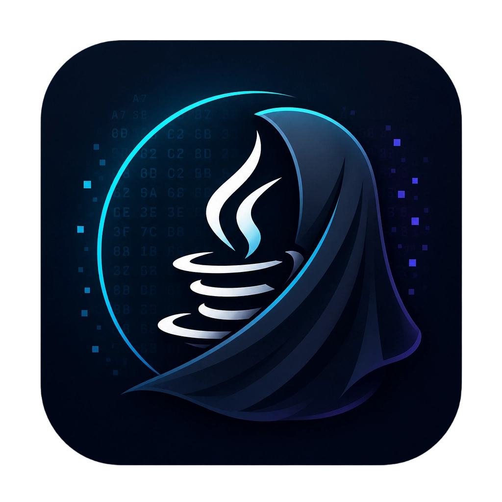
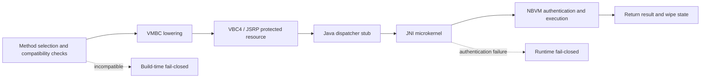

<p align="center">
  
</p>

<h1 align="center">JavaShroud</h1>

<p align="center">
  <strong>A Java obfuscation, virtualization, and Native hardening toolchain</strong>
</p>

<p align="center">
  
  
  
  
</p>

<p align="center">
  <a href="README.md">简体中文</a> · <strong>English</strong>
</p>

## Positioning

JavaShroud combines Java bytecode transformation, method virtualization, a Native microkernel, and a desktop workflow into one obfuscation and hardening toolchain. Alongside renaming, string protection, and control-flow transformations, selected methods can be converted into VMBC resources and executed by a Native bytecode VM (NBVM).

The current major release line is `0.11`.

The project follows a Kerckhoffs-oriented design: protection strength comes primarily from per-artifact keys, structural diversity, runtime authentication, and the Java / Native execution boundary rather than long-term secrecy of the implementation. A self-contained artifact still carries the material required to run, so the goal is to increase analysis and cross-sample reuse cost rather than claim absolute irreversibility.

## Core Capabilities

| Area | Representative capabilities |
| --- | --- |
| Bytecode obfuscation | Class, package, method, and field renaming; integer and string protection |
| Control-flow protection | Control-flow transformation, flattening, reference proxies, `invokedynamic` / `condy` indirection |
| Method virtualization | JVM bytecode lowering to VBC4 / VMBC executed by a Native VM |
| Resource protection | JSRP envelopes, section encryption, HMAC, slicing, manifests, and diversified layouts |
| Runtime defenses | Integrity gates, state binding, anti-instrumentation, and anti-dump checks |
| Native hardening | Authenticated shell, inner-kernel packing, platform loaders, and tamper fail-closed behavior |
| Desktop workflow | Wails + Vue UI, configuration editing, and engine task management |

The default pipeline stays conservative. Strong protection features should be enabled according to compatibility and performance requirements.

## VMBC / NBVM Execution Path

`method-virtualization` converts selected Java methods into VBC4 / VMBC resources. A lightweight dispatcher stub replaces the original method body. At runtime, `JniMicrokernelHelper.executeVmResource` enters the JNI microkernel, and the Native VM behind `js_vm_execute_resource` authenticates, parses, executes, and wipes sensitive state.


```mermaid
flowchart LR
  A["Method selection and compatibility checks"] --> B["VMBC lowering"]
  B --> C["VBC4 / JSRP protected resource"]
  C --> D["Java dispatcher stub"]
  D --> E["JNI microkernel"]
  E --> F["NBVM authentication and execution"]
  F --> G["Return result and wipe state"]
  A -.incompatible.-> X["Build-time fail-closed"]
  E -.authentication failure.-> Y["Runtime fail-closed"]
```

Per-artifact material, entry tokens, opcode dialects, resource paths, layout digests, and Native profiles constrain this execution path together. Methods that are not selected or compatible remain within the ordinary bytecode-obfuscation boundary.

## Native Hardening

The user-facing name is **Native hardening**. The `jni-microkernel-loader.nativePackingLevel` option retains `off`, `standard`, and `max` levels, with `max` as the current high-strength default:

- A loadable outer `js_kernel_<platform>` stub contains the complete inner kernel as an authenticated encoded payload.
- `JNI_OnLoad` verifies the header, section digest, layout and dispatcher profile, payload binding, chunk tags, and payload MAC.
- The Java layer loads only the outer stub and keeps no Java unpacking fallback. Resource, index, profile, or shell-metadata tampering fails closed.
- The Native kernel is bound to VMBC resources, the bootstrap index, resource paths, and the manifest mesh to reduce direct cross-artifact replacement and replay.

| Platform | Current hardening boundary |
| --- | --- |
| Windows x64 | PE64 in-memory mapping with section, relocation, import / export, TLS, `DllMain`, `JNI_OnLoad`, and ABI-table validation |
| Linux x64 | Anonymous-memory ELF64 loader with `PT_LOAD` / `PT_DYNAMIC`, hash, symbol, RELA / PLT, initializer, and entrypoint validation |
| macOS x64 / arm64 | Outer stub plus Mach-O metadata, rebase / bind, export-trie, and initializer validation; unsupported anonymous execution mapping fails closed |

## Compared With JNIC / Native Obfuscation

| Dimension | Typical JNIC / Native obfuscation | JavaShroud VMBC / NBVM |
| --- | --- | --- |
| Conversion target | Java method to native function | Java method to VMBC resource |
| Execution | JNI calls the corresponding native function | Native VM authenticates, parses, and dispatches virtual instructions |
| Main analysis surface | JNI bridge, exports, and machine code | Dispatcher, resource envelope, virtual ISA, VM state, and Native boundary |
| Diversification | Native compiler output | Per-artifact keys, layout, opcodes, tokens, and runtime profiles |

The approaches are complementary. JavaShroud makes the Native layer part of a virtual execution protocol rather than only a place to move code.

## Compatibility

- JavaShroud itself builds and runs on JDK 21+.
- Renaming, metadata cleanup, and most basic passes can process Java 8 classfiles without intentionally raising the classfile version.
- `ConstantDynamic` features require Java 11+. VMBC, the Native loader, and most runtime protection features target Java 11+ runtimes.
- Native hardening depends on the target platform, JNI, and local build toolchain. Release acceptance should use the actual packaged artifact.

## Quick Start

```powershell
# Build the core engine
.\gradlew.bat :core-engine:jar

# Inspect the CLI schema
java -jar build\core-engine\libs\obfuscator-engine.jar -schema

# Process a JAR with a TOML configuration
java -jar build\core-engine\libs\obfuscator-engine.jar -config path\to\config.toml
```

Desktop development:

```powershell
corepack yarn --cwd desktop-app\frontend install --immutable
corepack yarn --cwd desktop-app\frontend build

Set-Location desktop-app
go build ./...
go test ./...
```

Full Windows release entrypoint:

```powershell
.\build-release.bat
```

The release script builds the core engine, GraalVM native engine, frontend assets, and Wails desktop application into `build\release\javashroud-windows-amd64\`. `.github/workflows/release.yml` builds and publishes a GitHub Release when a `v*` tag is pushed.

## Repository Layout

```text
core-engine/          Kotlin / Java engine, VMBC, and Native runtime
desktop-app/          Go / Wails desktop host and Vue frontend
annotations/          JavaShroud annotation module
scripts/              Verification and utility scripts
assets/               README and release assets
build-release.bat     Windows release entrypoint
```

## License

JavaShroud is released under the [GNU GPL v3](LICENSE). See [THIRD_PARTY_NOTICES.md](THIRD_PARTY_NOTICES.md) and [NOTICE](NOTICE) for third-party and vendored-source notices.

## Acknowledgements

- [Open-MyJ2c](https://github.com/MyJ2c/Open-MyJ2c)
- [native-obfuscator](https://github.com/radioegor146/native-obfuscator)
- [skidfuscator-java-obfuscator](https://github.com/skidfuscatordev/skidfuscator-java-obfuscator)
- [Tigress_protection](https://github.com/JonathanSalwan/Tigress_protection)
