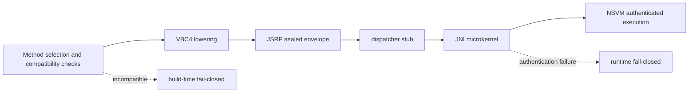

<p align="center">
  
</p>

<h1 align="center">JavaShroud</h1>

<p align="center">
  <strong>A Java obfuscation, virtualization, and Native packing toolchain</strong>
</p>

<p align="center">
  
  
  
  
</p>
<p align="center">
  <a href="README.md">简体中文</a> · <strong>English</strong>
</p>

## Positioning

JavaShroud is a Java obfuscation and hardening toolchain: a Kotlin engine performs bytecode transformation, selected methods can be lowered into VMBC resources executed by a Native bytecode VM (NBVM), and a Wails + Vue desktop app handles configuration and task management.

The design is Kerckhoffs-oriented: protection strength comes from per-artifact keys, layouts, opcode dialects, and the Java / Native execution boundary, not from long-term secrecy of the implementation. The artifact ships with everything needed to run, so the goal is to raise the cost of analysis and cross-sample reuse rather than claim absolute irreversibility.

## Core Capabilities

| Area | Pass / entry point |
| --- | --- |
| Renaming | `rename-classes`, `rename-packages`, `rename-methods`, `rename-fields` (stable) |
| Constants and strings | `integer-constant-obfuscation`, `string-encryption`, `field-string-encryption` |
| Control flow | `control-flow-obfuscation`, `control-flow-flattening`, `reference-proxy`, `invoke-dynamic-indirection`, `condy-constant-indirection` |
| Method virtualization | `method-virtualization`: JVM bytecode lowering to VBC4, executed by the NBVM |
| Resource and class encryption | JSRP resource envelopes, `class-encryption-loader`, `method-body-delayed-decryption` |
| Runtime defenses | `anti-instrumentation`, `anti-dump-protection`, `environment-bound-keys`, `callsite-rotation-protection`, `anti-symbolic-execution`, `exception-semantic-virtualization` |
| Native runtime | `jni-microkernel-loader`: AKEN-R1 Rust runtime, authenticated resources, and platform binding |
| Desktop workflow | Wails + Vue UI, configuration editing, engine task management |

26 passes are registered; the default pipeline contains only `strip-compile-debug-info`. Stable passes are enabled by default. Experimental passes must be enabled explicitly in the config, and opt-in passes additionally require `allowOptInPasses = true`.

## Control-flow obfuscation

JavaShroud has two control-flow passes. `control-flow-obfuscation` rewrites existing branch and exception-handler structure. `control-flow-flattening` adds dispatch blocks and noise inside a method. `reference-proxy`, `invoke-dynamic-indirection`, and `condy-constant-indirection` change call or constant-resolution paths and can be used alongside those passes when needed.

`control-flow-obfuscation` inserts opaque predicates at method entry and wraps selected `GOTO` edges with equivalent dispatch. Predicate families include quadratic residues, bitwise identities, and modular arithmetic; `mixed` chooses among them. Jumps can use `if-chain`, `lookupswitch`, or `tableswitch-hybrid`. `density` controls how many jumps are considered, `frequency` controls predicate insertion, and `seed` reproduces the same selection.

The pass also has two structural rewrites:

- `branchInjection` replaces frame-verified empty-stack `GOTO` edges with conditional edges backed by a synthetic state field. Its levels are `light`, `normal`, and `aggressive`.
- `handlerSplit` splits eligible same-type pure-rethrow handlers into overlapping protected ranges and a relay. Its levels are `light` and `heavy`.

`control-flow-flattening` adds another layer. It uses `density` to select insertion points and supports `arithmetic-nop`, `dead-branch`, `unreachable-method`, and `field-noise` dispatch-block patterns. Handler bodies can remain `nop` or use synthetic field writes and synthetic method calls.

### Choosing a level

| Goal | Suggested combination | Output effect |
| --- | --- | --- |
| Low disruption | `control-flow-obfuscation`, `density = 3..5`, `if-chain` | Adds entry predicates and a small number of synthetic edges, with lower size and debugging impact. |
| General protection | `density = 6..8`, `algebraicFamily = "mixed"`, plus `control-flow-flattening` | Mixes predicate and dispatch-block forms within a method, producing less direct decompiler output. |
| High disruption | `density = 9..10`, `tableswitch-hybrid` or `lookupswitch`, with compatible `branchInjection` / `handlerSplit` | Changes more branch, exception-table, and local-dispatch structure; exception paths, hot methods, and startup time need focused testing. |
| High-value logic | Control-flow passes plus call indirection and string / constant protection; use `method-virtualization` where required | Changes call resolution as well, or moves selected methods into VMBC / NBVM execution. |

“Strength” here means the amount of work required for static reading, CFG recovery, and pattern matching. It is not an irreversibility claim. JVM instructions remain in the artifact, and invariant conditions or dead paths can be simplified with enough analysis time. Start with a small set of important classes and expand only after testing.

The passes do not force coverage. Constructors, interfaces, abstract / native methods, and high-risk shapes involving monitors, switches, uninitialized objects, or complex exception tables are skipped. Changed methods have their StackMap frames recomputed and are analyzed again. Before release, run `java -Xverify:all`, start the application, and cover the business paths that matter.

## Resource Envelopes: JSRP

JSRP is the project's protected resource envelope format (magic `JSRP`, current version 7). VM bytecode, Native libraries, manifests, and the bootstrap index are all sealed through `RuntimeResourceCodec`:

- Layout: a 27-byte header + 96 bytes of encrypted metadata + an AES-CTR body + a 32-byte HMAC-SHA256 tag. Keys and IVs for metadata and body are derived from the partition key via HMAC domain separation.
- Keys come from a build-time CSPRNG-generated partition table (`RuntimeKeyPartitions`) and are selected per resource partition; any change to header, metadata, or body fails tag verification.
- The body is zstd-compressed by default (`Vbc4ZstdCodec`); metadata records the SHA-256 of both plaintext and compressed bytes, and decode re-checks lengths and hashes at each step.

Field layout and the decode flow are in `RuntimeResourceCodec`.

## VMBC / NBVM Execution Path

`method-virtualization` lowers selected Java methods into VBC4 bytecode (`VmBytecodeSerializer`) sealed as JSRP resources; the original method body is replaced by a dispatcher stub. At runtime the stub calls `JniMicrokernelHelper.executeVmResource(entryToken, …)` to enter the JNI microkernel, and the Native VM behind `js_vm_execute_resource` authenticates, parses, executes, and wipes sensitive state.


```mermaid
flowchart LR
  A["Method selection and compatibility checks"] --> B["VBC4 lowering"]
  B --> C["JSRP sealed envelope"]
  C --> D["dispatcher stub"]
  D --> E["JNI microkernel"]
  E --> F["NBVM authenticated execution"]
  A -.incompatible.-> X["build-time fail-closed"]
  E -.authentication failure.-> Y["runtime fail-closed"]
```

Execution entry is bound to per-artifact entry tokens, opcode dialects, resource paths, layout digests, and the dispatcher profile (`DispatcherProfile`). Methods that are not selected or not compatible stay within the ordinary bytecode-obfuscation boundary.

## Native hardening

AKEN-R1 uses the Rust-only runtime boundary and the final authenticated resource locator:

- Production resources are selected only for Windows x64 and Linux x64, then bound to the final artifact digest and current runtime format.
- Resource, platform, length, image, and binding failures reject loading; Java does not fall back to an old C shell or system-path library.
- The former `NativeKernelShellPacker` C shell, Mach-O loader, Zig entrypoints, and `.dylib` outputs are retired and remain fail-closed only for stale source fixtures.

### Platform Boundaries

| Platform | AKEN-R1 Native boundary |
| --- | --- |
| Windows x64 | Rust runtime; the only cargo target is `x86_64-pc-windows-gnu`, with a `.dll` resource; the old PE/C loader is not a production path |
| Linux x64 | Rust runtime; the only cargo target is `x86_64-unknown-linux-gnu.2.17`, with a `.so` resource; the old ELF/C loader is not a production path |
| Other platforms | macOS, Mach-O, and `.dylib` selection, build, resource, and load paths fail closed |

AKEN-R1 no longer compiles, packages, or runs the retired C/Zig Native runtime. Retired build/cache/temp entrypoints remain only as fail-closed quarantine shims.

## Compared With JNIC / Native Obfuscation

| Dimension | Typical JNIC / Native obfuscation | JavaShroud VMBC / NBVM |
| --- | --- | --- |
| Conversion target | Java method to native function | Java method to VMBC resource |
| Execution | JNI calls the corresponding native function | Native VM authenticates, parses, and dispatches virtual instructions |
| Main analysis surface | JNI bridge, exports, and machine code | Dispatcher, resource envelope, virtual ISA, VM state, and Native boundary |
| Diversification | Native compiler output | Per-artifact keys, layout, opcodes, tokens, and runtime profiles |

The two approaches are not mutually exclusive; in JavaShroud the Native layer is part of a virtual execution protocol, not only a place to move code.

## Compatibility

- The JavaShroud engine itself builds and runs on JDK 21+.
- Renaming, metadata cleanup, and most basic passes can process Java 8 classfiles without raising the classfile version.
- `ConstantDynamic` features require Java 11+; VMBC, the Rust Native runtime, and most runtime defense passes target Java 11+ runtimes.
- The Native runtime accepts only the declared AKEN-R1 Windows/Linux x64 targets; release acceptance should use the final artifact digest, locator, and runtime result.

## Quick Start

```powershell
# Build the core engine
.\gradlew.bat :core-engine:jar

# Inspect the CLI schema (pass list, parameters, default pipeline)
java -jar build\core-engine\libs\obfuscator-engine-0.12.jar -schema

# Process a JAR with a TOML configuration
java -jar build\core-engine\libs\obfuscator-engine-0.12.jar -config path\to\config.toml
```

Minimal configuration example:

```toml
inputJarPath = "app.jar"
outputJarPath = "app-obf.jar"
allowOptInPasses = true

[[passes]]
id = "rename-classes"
enabled = true

[[passes]]
id = "control-flow-flattening"
enabled = true

[ruleSet]
[[ruleSet.rules]]
target = "class **"
action = "obfuscate"

[[ruleSet.rules]]
target = "class com.example.api.**"
action = "exclude"
```

Desktop development:

```powershell
corepack yarn --cwd desktop-app\frontend install --immutable
corepack yarn --cwd desktop-app\frontend build

Set-Location desktop-app
go build ./...
go test ./...
```

Full Windows release entrypoint:

```powershell
.\build-release.bat
```

The release script builds the core engine, the GraalVM native engine, frontend assets, and the Wails desktop application into `build\release\javashroud-windows-amd64\`. `.github/workflows/release.yml` builds and publishes a GitHub Release when a `v*` tag is pushed.

## Repository Layout

```text
core-engine/          Kotlin / Java engine, VMBC, and Native runtime
desktop-app/          Go / Wails desktop host and Vue frontend
annotations/          JavaShroud annotation module
assets/               README and release assets
build-release.bat     Windows release entrypoint
```

## License

JavaShroud is released under the [GNU GPL v3](LICENSE). See [THIRD_PARTY_NOTICES.md](THIRD_PARTY_NOTICES.md) and [NOTICE](NOTICE) for third-party and vendored-source notices.

## Acknowledgements

- [Open-MyJ2c](https://github.com/MyJ2c/Open-MyJ2c)
- [native-obfuscator](https://github.com/radioegor146/native-obfuscator)
- [skidfuscator-java-obfuscator](https://github.com/skidfuscatordev/skidfuscator-java-obfuscator)
- [Tigress_protection](https://github.com/JonathanSalwan/Tigress_protection)
