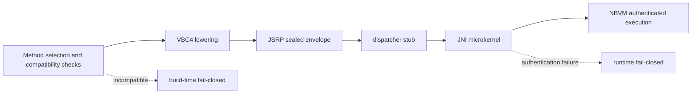

<p align="center">
  
</p>

<h1 align="center">JavaShroud</h1>

<p align="center">
  <strong>A Java obfuscation, virtualization, and Native packing toolchain</strong>
</p>

<p align="center">
  
  
  
  
</p>
<p align="center">
  <a href="README.md">简体中文</a> · <strong>English</strong>
</p>

## Positioning

JavaShroud is a Java obfuscation and hardening toolchain: a Kotlin engine performs bytecode transformation, selected methods can be lowered into VMBC resources executed by a Native bytecode VM (NBVM), and a Wails + Vue desktop app handles configuration and task management.

The design is Kerckhoffs-oriented: protection strength comes from per-artifact keys, layouts, opcode dialects, and the Java / Native execution boundary, not from long-term secrecy of the implementation. The artifact ships with everything needed to run, so the goal is to raise the cost of analysis and cross-sample reuse rather than claim absolute irreversibility.

## Core Capabilities

| Area | Pass / entry point |
| --- | --- |
| Renaming | `rename-classes`, `rename-packages`, `rename-methods`, `rename-fields` (stable) |
| Constants and strings | `integer-constant-obfuscation`, `string-encryption`, `field-string-encryption` |
| Control flow | `control-flow-obfuscation`, `control-flow-flattening`, `reference-proxy`, `invoke-dynamic-indirection`, `condy-constant-indirection` |
| Method virtualization | `method-virtualization`: JVM bytecode lowering to VBC4, executed by the NBVM |
| Resource and class encryption | JSRP resource envelopes, `class-encryption-loader`, `method-body-delayed-decryption` |
| Runtime defenses | `anti-instrumentation`, `anti-dump-protection`, `environment-bound-keys`, `callsite-rotation-protection`, `anti-symbolic-execution`, `exception-semantic-virtualization` |
| Native packing | `jni-microkernel-loader`: authenticated shell + inner-kernel packing + platform loaders |
| Desktop workflow | Wails + Vue UI, configuration editing, engine task management |

26 passes are registered; the default pipeline contains only `strip-compile-debug-info`. Stable passes are enabled by default. Experimental passes must be enabled explicitly in the config, and opt-in passes additionally require `allowOptInPasses = true`. The full list, parameters, and enablement boundaries are in [docs/TECHNICAL_EN.md](docs/TECHNICAL_EN.md).

## Resource Envelopes: JSRP

JSRP is the project's protected resource envelope format (magic `JSRP`, current version 7). VM bytecode, Native libraries, manifests, and the bootstrap index are all sealed through `RuntimeResourceCodec`:

- Layout: a 27-byte header + 96 bytes of encrypted metadata + an AES-CTR body + a 32-byte HMAC-SHA256 tag. Keys and IVs for metadata and body are derived from the partition key via HMAC domain separation.
- Keys come from a build-time CSPRNG-generated partition table (`RuntimeKeyPartitions`) and are selected per resource partition; any change to header, metadata, or body fails tag verification.
- The body is zstd-compressed by default (`Vbc4ZstdCodec`); metadata records the SHA-256 of both plaintext and compressed bytes, and decode re-checks lengths and hashes at each step.

Field layout and the decode flow are documented in [docs/TECHNICAL_EN.md](docs/TECHNICAL_EN.md).

## VMBC / NBVM Execution Path

`method-virtualization` lowers selected Java methods into VBC4 bytecode (`VmBytecodeSerializer`) sealed as JSRP resources; the original method body is replaced by a dispatcher stub. At runtime the stub calls `JniMicrokernelHelper.executeVmResource(entryToken, …)` to enter the JNI microkernel, and the Native VM behind `js_vm_execute_resource` authenticates, parses, executes, and wipes sensitive state.


```mermaid
flowchart LR
  A["Method selection and compatibility checks"] --> B["VBC4 lowering"]
  B --> C["JSRP sealed envelope"]
  C --> D["dispatcher stub"]
  D --> E["JNI microkernel"]
  E --> F["NBVM authenticated execution"]
  A -.incompatible.-> X["build-time fail-closed"]
  E -.authentication failure.-> Y["runtime fail-closed"]
```

Execution entry is bound to per-artifact entry tokens, opcode dialects, resource paths, layout digests, and the dispatcher profile (`DispatcherProfile`). Methods that are not selected or not compatible stay within the ordinary bytecode-obfuscation boundary.

## Native Packing

The user-facing name is **Native hardening**; the implementation is a two-layer shell-kernel structure (`NativeKernelShellPacker`):

- The Java layer `System.load`s the outer `js_kernel_<platform>` stub directly; the complete inner kernel is sealed inside the shell as an authenticated, encoded payload.
- `JNI_OnLoad` verifies the header, section digest, layout and dispatcher profile, payload binding, chunk tags, and payload MAC in sequence; any failure rejects execution, and there is no Java unpacking fallback.
- The Native kernel is bound to VMBC resources, the bootstrap index, resource paths, and the manifest, so a shell cannot be transplanted or replayed across artifacts.
- The `jni-microkernel-loader.nativePackingLevel` option has `off` / `standard` / `max` / `max-hardening` levels, with `max` as the current high-strength default; `bootKeyDelivery` defaults to `external-file` and can be set explicitly to `embedded`.

### Boot KEK Contract

With `jni-microkernel-loader` enabled, the build side and the runtime side must hold the same 256-bit Boot KEK. The artifact always contains the AES-GCM sealed `META-INF/.r/boot.dat` (`BootMaterialEnvelope`, carrying the master key, JAR layout digest, partition key slots, and per-platform shell binding commitments). The default `bootKeyDelivery = "external-file"` keeps the KEK outside the artifact; explicit `bootKeyDelivery = "embedded"` stores the build sidecar bytes under a randomized sealed resource path so direct `java -jar` startup no longer needs a sidecar file.

- environment variable `JAVASHROUD_BOOT_SECRET_V1`: exactly 64 hexadecimal characters;
- the file named by `JAVASHROUD_BOOT_SECRET_FILE_V1`: 32 raw bytes or 64 hexadecimal characters.

Runtime lookup order is `JAVASHROUD_BOOT_SECRET_V1` → `JAVASHROUD_BOOT_SECRET_FILE_V1` → the embedded JAR resource. If an explicit environment variable is present but malformed or fails authentication, startup fails directly instead of falling back to the embedded value. A missing or malformed KEK and authentication failures all fail closed. Shell binding commitments exist only inside the encrypted boot.dat and are delivered once by the JVM during `JNI_OnLoad`; the Native library does not embed an expectation that could be swapped with the shell bundle. In the default external mode, inject and rotate the KEK through deployment secret management; do not place it in configuration files, Native libraries, or the source repository.

### Platform Boundaries

| Platform | Current packing boundary |
| --- | --- |
| Windows x64 | PE64 in-memory mapping with section, relocation, import / export, TLS, `DllMain`, `JNI_OnLoad`, and ABI-table validation |
| Linux x64 | Anonymous-memory ELF64 loader with `PT_LOAD` / `PT_DYNAMIC`, hash, symbol, RELA / PLT, initializer, and entrypoint validation |
| macOS x64 / arm64 | Outer stub plus Mach-O metadata, rebase / bind, export-trie, and initializer validation; unsupported anonymous execution mapping fails closed |

The shell protocol and KEK delivery chain are documented in [docs/TECHNICAL_EN.md](docs/TECHNICAL_EN.md).

## Compared With JNIC / Native Obfuscation

| Dimension | Typical JNIC / Native obfuscation | JavaShroud VMBC / NBVM |
| --- | --- | --- |
| Conversion target | Java method to native function | Java method to VMBC resource |
| Execution | JNI calls the corresponding native function | Native VM authenticates, parses, and dispatches virtual instructions |
| Main analysis surface | JNI bridge, exports, and machine code | Dispatcher, resource envelope, virtual ISA, VM state, and Native boundary |
| Diversification | Native compiler output | Per-artifact keys, layout, opcodes, tokens, and runtime profiles |

The two approaches are not mutually exclusive; in JavaShroud the Native layer is part of a virtual execution protocol, not only a place to move code.

## Compatibility

- The JavaShroud engine itself builds and runs on JDK 21+.
- Renaming, metadata cleanup, and most basic passes can process Java 8 classfiles without raising the classfile version.
- `ConstantDynamic` features require Java 11+; VMBC, the Native loader, and most runtime defense passes target Java 11+ runtimes.
- Native packing depends on the target platform, JNI, and the local build toolchain; release acceptance should use the actual packaged artifact.

## Quick Start

```powershell
# Build the core engine
.\gradlew.bat :core-engine:jar

# Inspect the CLI schema (pass list, parameters, default pipeline)
java -jar build\core-engine\libs\obfuscator-engine-0.12.jar -schema

# Process a JAR with a TOML configuration
java -jar build\core-engine\libs\obfuscator-engine-0.12.jar -config path\to\config.toml
```

Minimal configuration example:

```toml
inputJarPath = "app.jar"
outputJarPath = "app-obf.jar"
allowOptInPasses = true

[[passes]]
id = "rename-classes"
enabled = true

[[passes]]
id = "control-flow-flattening"
enabled = true

[ruleSet]
[[ruleSet.rules]]
target = "class **"
action = "obfuscate"

[[ruleSet.rules]]
target = "class com.example.api.**"
action = "exclude"
```

Config fields, rule syntax, and a complete example enabling VMBC and Native packing are in [docs/TECHNICAL_EN.md](docs/TECHNICAL_EN.md).

Desktop development:

```powershell
corepack yarn --cwd desktop-app\frontend install --immutable
corepack yarn --cwd desktop-app\frontend build

Set-Location desktop-app
go build ./...
go test ./...
```

Full Windows release entrypoint:

```powershell
.\build-release.bat
```

The release script builds the core engine, the GraalVM native engine, frontend assets, and the Wails desktop application into `build\release\javashroud-windows-amd64\`. `.github/workflows/release.yml` builds and publishes a GitHub Release when a `v*` tag is pushed.

## Repository Layout

```text
core-engine/          Kotlin / Java engine, VMBC, and Native runtime
desktop-app/          Go / Wails desktop host and Vue frontend
annotations/          JavaShroud annotation module
docs/                 Deep-dive documentation (TECHNICAL.md / TECHNICAL_EN.md)
scripts/              Verification and utility scripts
assets/               README and release assets
build-release.bat     Windows release entrypoint
```

## License

JavaShroud is released under the [GNU GPL v3](LICENSE). See [THIRD_PARTY_NOTICES.md](THIRD_PARTY_NOTICES.md) and [NOTICE](NOTICE) for third-party and vendored-source notices.

## Acknowledgements

- [Open-MyJ2c](https://github.com/MyJ2c/Open-MyJ2c)
- [native-obfuscator](https://github.com/radioegor146/native-obfuscator)
- [skidfuscator-java-obfuscator](https://github.com/skidfuscatordev/skidfuscator-java-obfuscator)
- [Tigress_protection](https://github.com/JonathanSalwan/Tigress_protection)
