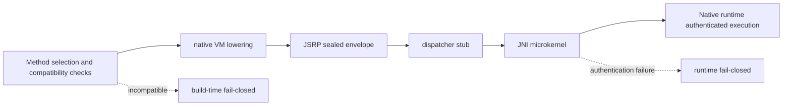

<p align="center">
  
</p>

<h1 align="center">JavaShroud</h1>

<p align="center">
  <strong>A Java obfuscation, virtualization, and Native packing toolchain</strong>
</p>

<p align="center">
  
  
  
  
</p>
<p align="center">
  <a href="README.md">简体中文</a> · <strong>English</strong>
</p>

## Positioning

JavaShroud is a Java obfuscation and hardening toolchain: a Kotlin engine performs bytecode transformation, selected methods are lowered into protected resources executed by the Native runtime, and a Wails + Vue desktop app handles configuration editing, class-tree browsing, and task management. The design leans toward Kerckhoffs' principle — strength comes from per-artifact keys, layouts, opcode dialects, and the Java / Native execution boundary, all generated independently per artifact; public implementation details do not weaken the protection of a single artifact.

Each build generates dedicated material for its artifact: 6–16 resource partition keys plus an anchor key, a 256-bit opcode dialect commitment, page key slots, and native locator routing and binding digests. The same input produces different key layouts, dialect masks, and native digests in different builds while runtime behavior stays identical. The artifact ships with everything needed to run, so the analyst faces a self-contained encrypted container and a native kernel that accepts only that container.

Beyond bytecode transformation and the Native runtime, the compiled native image can additionally be mirror-packed by [Xenolith](https://github.com/HHT0rro/Xenolith), an independent open-source PE packer — completing a protection chain of bytecode obfuscation, method virtualization, Native runtime, and image packing.

## Core Capabilities

| Area | Pass / entry point |
| --- | --- |
| Renaming | `rename-classes`, `rename-packages`, `rename-methods`, `rename-fields` |
| Constants and strings | `integer-constant-obfuscation`, `string-encryption`, `field-string-encryption` |
| Control flow | `control-flow-obfuscation`, `control-flow-flattening`, `reference-proxy`, `invoke-dynamic-indirection`, `condy-constant-indirection` |
| Metadata and structure | `strip-compile-debug-info`, `member-shuffle`, `member-hide`, `static-init-perturbation`, `anti-decompiler-structure` |
| Method virtualization | `method-virtualization`: JVM bytecode lowered to native VM bytecode, executed by the Native dispatcher |
| Resource and class protection | JSRP v8 authenticated resource envelopes and native typed-page routing |
| Runtime defenses | `os-anti-debug`, `os-anti-vm`, `callsite-rotation-protection`, `exception-semantic-virtualization` |
| Native runtime | `jni-microkernel-loader`: Qp Rust runtime, authenticated resources, and platform binding |
| Native packing | `nativeshroud`: Xenolith auto packing (`fast` / `standard` / `max` profiles), pre-packed image mounting, desktop packing handoff |
| Desktop workflow | Wails + Vue UI, configuration editing, class tree and method selection, task runs and event log |

The engine registers 24 passes. The default pipeline reported by `-schema` contains only `strip-compile-debug-info`. When the config sets `protectionProfile = "release-hardened"` with an empty `passes` list, the engine expands a 13-pass hardened pipeline:

```text
rename-packages, rename-classes, rename-methods, rename-fields, string-encryption,
invoke-dynamic-indirection, callsite-rotation-protection, jni-microkernel-loader,
os-anti-debug, os-anti-vm, method-virtualization, strip-compile-debug-info,
control-flow-flattening
```

Configuration is validated before the run: `requiredPassIds` are completed automatically, `requiresAnyPassIds` must be satisfied by the config, and passes marked `requiresOptIn = true` or `risk = high` in the schema require `allowOptInPasses = true`. Non-compliant combinations exit with an error instead of degrading.

## Control-flow obfuscation

`control-flow-obfuscation` rewrites the structure around existing branches and exception handlers, `control-flow-flattening` adds dispatch blocks and noise structures, and `reference-proxy`, `invoke-dynamic-indirection`, `condy-constant-indirection` change call or constant-resolution paths. All three can be combined freely.

`control-flow-obfuscation` inserts opaque predicates at method entry and wraps a `density`-selected share of `GOTO` edges with equivalent dispatch:

| Parameter | Values | Effect |
| --- | --- | --- |
| `density` | 1–10, default 5 | Probability that a given `GOTO` is rewritten: 1 ≈ 1/10, 10 rewrites all |
| `dispatchMode` | `if-chain` (default), `lookupswitch`, `tableswitch-hybrid`, `mixed` | Instruction shape of the equivalent dispatch |
| `algebraicFamily` | `quadratic-residue`, `bitwise-identity`, `modular-arithmetic`, `mixed` (default) | Algebraic family of the opaque predicates |
| `branchInjection` | `none` (default), `light`, `normal`, `aggressive` | Rewrites frame-verified empty-stack `GOTO` edges into conditional edges reading a synthetic state field |
| `handlerSplit` | `none` (default), `light`, `heavy` | Splits pure-rethrow handlers into overlapping protected ranges and a relay |

Rewrite scope is decided by method structure:

- Predicate and dispatch rewrites skip interfaces, `<clinit>`, abstract / native methods, and methods with fewer than 2 instructions.
- `branchInjection` only handles `GOTO` edges whose source and target frames both have empty stacks, and skips `<init>`, `<clinit>`, methods with exception handlers, and methods containing monitors, `NEW`, `JSR` / `RET`, or `tableswitch` / `lookupswitch`.
- `handlerSplit` requires a method with no branches and exactly one typed handler whose body is the three-instruction pure rethrow `ASTORE` / `ALOAD` / `ATHROW`.

`control-flow-flattening` takes `density` (1–10, default 5), `pattern` (`arithmetic-nop`, `dead-branch` (default), `unreachable-method`, `field-noise`) and `handlerComplexity` (`nop` (default), `field-write`, `method-call`); it skips constructors, `<clinit>`, `GOTO` edges with non-conserved monitor depth, and edges that jump into a handler.

### Choosing a strength level

| Goal | Suggested combination | Artifact characteristics |
| --- | --- | --- |
| Low disruption | `control-flow-obfuscation`, `density = 3..5`, `dispatchMode = "if-chain"` | Entry predicates plus a few synthetic edges; controlled size and debugging impact |
| General protection | `density = 6..8`, `algebraicFamily = "mixed"`, plus `control-flow-flattening` | Multiple predicate and dispatch forms mixed within a method; decompiler output becomes scattered |
| High disruption | `density = 9..10`, `tableswitch-hybrid` or `lookupswitch`, with compatible `branchInjection` / `handlerSplit` | Jump graph, exception tables, and local dispatch structure change noticeably; exception paths, hot methods, and startup time need dedicated testing |
| High-value logic | Control-flow passes plus call / constant indirection, and `method-virtualization` where warranted | Beyond the ordinary bytecode layer there is call-resolution rewriting and Native VM execution |

Strength corresponds to the work required for static reading, CFG recovery, and pattern matching. The output is still standard JVM instructions: identity conditions and dead paths can be simplified with enough analysis time, and exception tables and frame info must stay self-consistent to pass verification. Start from a small set of key classes and expand gradually.

Transformed classes get their StackMap frames recomputed and re-analyzed; before release, run `java -Xverify:all`, application startup, and the key business regressions.

## Resource Envelopes: JSRP

JSRP is the project's internal protected resource format (magic `JSRP`, current version 8). VM bytecode, native libraries, manifests, and the bootstrap index are all sealed through `QpResourceCodec`:

- Layout: a 27-byte header + 96 bytes of encrypted metadata + an AES-CTR body + a 32-byte HMAC-SHA256 tag; the metadata and body keys and IVs are derived from the partition keys with HMAC domain separation.
- Keys come from build-time CSPRNG-generated `RuntimeKeyPartitions`: 6–16 resource partition keys plus one anchor key, with each resource mapped to a partition slot by its identity digest.
- Any change to the header, metadata, or body fails tag verification; decoding re-checks lengths, `storedHash`, and `plainHash` at every level.
- The body is zstd-compressed by default (`QpCompressionCodec`); metadata records the SHA-256 of both the plaintext and the compressed content.

Field layout and the decode flow are in `QpResourceCodec`.

## Method Virtualization Execution Path

`method-virtualization` lowers selected Java methods into native VM bytecode (`QpSerializer`), seals them as JSRP resources, and replaces the original method body with a dispatcher stub. At runtime the stub calls `QpBridge.executeQpVmPage(sealedEntryToken, encodedHandle, pageIndex, callSiteProof, args)` to enter the JNI microkernel, where the Rust side authenticates the resource, opens the page, executes instructions, and wipes sensitive state; strings go through `QpBridge.openQpString` and class pages through `readQpClassPage`.


```mermaid
flowchart LR
  A["Method selection and compatibility checks"] --> B["native VM lowering"]
  B --> C["JSRP sealed envelope"]
  C --> D["dispatcher stub"]
  D --> E["JNI microkernel"]
  E --> F["Native runtime authenticated execution"]
  A -.incompatible.-> X["build-time fail-closed"]
  E -.authentication failure.-> Y["runtime fail-closed"]
```

Execution entry is constrained by the per-artifact entry token, opcode dialect, resource path, layout digest, and dispatcher profile. The dispatcher profile is selected from `SWITCH`, `DIRECT_THREADED`, `INDIRECT_THREADED`, `CALL_THREADED`, `IF_NEST`, and `INTERPOLATION` based on the entry token, resource path, and manifest mesh. Method selection supports the `safe`, `critical-auto`, `critical-plus` (default), and `all-compatible` strategies; explicit member rules take priority, and `maxInstructions` / `maxBroadVirtualizedMethods` cap the scale. Methods found incompatible at build time stay inside the bytecode-obfuscation boundary.

## Native hardening

The Qp runtime is a Rust-only boundary, shipped with the engine under `core-engine/src/main/rust` and composed of the seven crates `qp-crypto`, `qp-page`, `qp-vm`, `qp-ffi`, `qp-resource`, `qp-runtime`, and `qp-shell`.

- Production resources are generated only for Windows x64 and Linux x64 and bound to the final artifact digest and the current runtime format; the toolchain pins Rust 1.78, Zig 0.13.0, and cargo-zigbuild 0.23.2, with a Linux glibc floor of 2.17.
- Any failed resource, platform, length, image-header, or binding check rejects loading; the Java side never falls back to the old C shell or system-path libraries.
- The compiled native image can additionally be packed externally through `nativeshroud` (Xenolith auto packing / pre-packed images / desktop handoff, all fail-closed); see the next section, "Native packing: Xenolith".
- The former `NativeKernelShellPacker` C shell, Mach-O loader, Zig entrypoints, and `.dylib` outputs are retired and remain fail-closed only for stale source fixtures.

### Platform Boundaries

| Platform | Current Qp Native boundary |
| --- | --- |
| Windows x64 | Rust runtime, cargo target `x86_64-pc-windows-gnu`, resource suffix `.dll`; the PE loader and old C paths are not production paths |
| Linux x64 | Rust runtime, cargo target `x86_64-unknown-linux-gnu.2.17`, resource suffix `.so`; the ELF loader and old C paths are not production paths |
| Other platforms | Including macOS, Mach-O, and `.dylib`: platform detection, build, resource selection, and loading all fail closed |

## Native packing: Xenolith

`nativeshroud` packs the compiled native image (the `qp_ffi.dll` on Windows x64) externally; the default path is [Xenolith](https://github.com/HHT0rro/Xenolith), an independent open-source Windows x64 PE packer (GPL-3.0). JavaShroud only spawns its CLI (`xenolith pack <qp_ffi.dll> -o <out> --profile <p> --json`) and never links its code. Packing happens before JSIM binding; a failed pack run, a missing image, or a cancel is fail-closed and refuses to ship.

### Profiles and function-level switches

| Parameter | Values | Effect |
| --- | --- | --- |
| `profile` | `fast`, `standard` (default), `max` | Pack profile: fast is quickest, standard is balanced, max adds anti-debug probes |
| `vmExports` | list of export names | Forwarded as `--vm-export` for function-level virtualization; JVM/CRT ABI names and the fast profile are rejected fail-fast engine-side |
| `selectRva` / `selectFunction` | repeatable | Forwarded as `--select-rva` / `--select-function` for function-level selection |
| `selectAll` / `strictCoverage` / `allowNativeFallback` | boolean | Full selection and coverage control; `selectAll` and `allowNativeFallback` are mutually exclusive |
| `protectImports` / `strictConstants` / `traceDiverge` | boolean | Import protection, constant protection, and divergence tracing |

`lazyRegions` is verified incompatible with the qp_ffi JNI host boot (the VEH wake cannot run under the loader lock, so the DLL initialization routine always fails) and is rejected engine-side with a named error.

### Desktop and build integration

- The desktop app embeds the Xenolith CLI into `javashroud.exe` (build tag `javashroud_embed_xenolith`) and ships `tools\xenolith.exe`; it is enabled with one switch on the "Custom packing" module. By default the bundled CLI packs automatically, or the run can pause for manual packing (VMP, etc.) and pick the packed file back up.
- When the build machine has no local xenolith.exe, `build-release.bat` calls `desktop-app\fetch-xenolith.ps1` to fetch it from GitHub Releases (skipping tags without a Windows asset), preferring the CN mirror chain `ghfast.top` → `gh-proxy.com` → `ghproxy.net` with direct GitHub as the fallback, and writes the binary atomically only after matching the per-artifact SHA-256 in the release `manifest.json`. Env overrides: `XENOLITH_MIRRORS` (semicolon-separated mirror prefixes, `-` disables mirrors), `XENOLITH_RELEASE_TAG` (pin a release tag), `XENOLITH_SHA256` (hard digest pin; mismatch fails).

### Packed-image contract

No matter where the image comes from — Xenolith, VMP, or any other packer — it must pass the same pre-validation before JSIM binding: it must be a PE64 DLL preserving the `.jsms` / `.jsmk` measurement sections and the `JNI_OnLoad` / `JNI_OnUnload` / `qp_r1_*` exports, or it is rejected with a named error. Non-CLI scenarios have two more paths: `packedPath` / `packedPathLinux` point directly at a pre-packed image, and with `JAVASHROUD_PACK_HANDOFF=1` the engine emits a `need-pack` event and waits for a path reply; Linux may reply `SKIP` to ship the unpacked `.so`.

## Compared With JNIC / Native Obfuscation

| Dimension | Typical JNIC / Native obfuscation | JavaShroud method virtualization |
| --- | --- | --- |
| Conversion target | Java method to native function | Java method to a protected Native VM resource |
| Execution | JNI calls the corresponding native function | Native VM authenticates, parses, and dispatches virtual instructions |
| Main analysis surface | JNI bridge, exports, and machine code | Dispatcher, resource envelope, virtual ISA, VM state, and Native boundary |
| Diversification | Native compiler output | Per-artifact keys, layout, opcodes, tokens, and runtime profiles |

The two approaches can coexist; in JavaShroud the Native layer is part of a virtual execution protocol.

## Compatibility

- The engine builds and runs on JDK 17+; CI builds and tests on JDK 17 and 21.
- Renaming, metadata cleanup, and most basic passes process Java 8 classfiles without raising the input major version.
- `condy-constant-indirection` relies on `CONSTANT_Dynamic` and requires Java 11+ classfiles.
- Method virtualization, the Rust Native runtime, and the runtime defenses target Java 11+ runtimes; native resources accept only Windows x64 and Linux x64.

## Quick Start

```powershell
# Build the core engine (artifact: build\core-engine\libs\obfuscator-engine-0.31.0.jar)
.\gradlew.bat :core-engine:jar

# List passes, parameters, the default pipeline, and compatibility constraints (TOML output)
java -jar build\core-engine\libs\obfuscator-engine-0.31.0.jar -schema

# Show the package / class / member tree of an input JAR
java -jar build\core-engine\libs\obfuscator-engine-0.31.0.jar -inspect app.jar

# Process a JAR with a TOML configuration
java -jar build\core-engine\libs\obfuscator-engine-0.31.0.jar -config path\to\config.toml

# Engine runtime-cache maintenance
java -jar build\core-engine\libs\obfuscator-engine-0.31.0.jar -gc
java -jar build\core-engine\libs\obfuscator-engine-0.31.0.jar -gc --apply
```

Configuration example (renaming + control-flow flattening; opt-in passes require `allowOptInPasses = true`):

```toml
inputJarPath = "app.jar"
outputJarPath = "app-obf.jar"
allowOptInPasses = true

[[passes]]
id = "rename-classes"
enabled = true

[[passes]]
id = "control-flow-flattening"
enabled = true

[ruleSet]
[[ruleSet.rules]]
target = "class **"
action = "obfuscate"

[[ruleSet.rules]]
target = "class com.example.api.**"
action = "exclude"
```

Desktop app:

```powershell
corepack yarn --cwd desktop-app\frontend install --immutable
corepack yarn --cwd desktop-app\frontend build

Set-Location desktop-app
go build ./...
go test ./...
```

Full Windows release:

```powershell
.\build-release.bat
```

The release script builds the core engine, the GraalVM native engine, frontend assets, and the Wails desktop app into `build\release\javashroud-windows-amd64\`. Pushing a `v*` tag makes `.github/workflows/release.yml` build and publish the GitHub Release.

## Repository Layout

```text
core-engine/          Kotlin / Java engine, method virtualization, and Rust Native runtime
desktop-app/          Go / Wails desktop host and Vue frontend
annotations/          JavaShroud annotation module
assets/               README and release assets
build-release.bat     Windows release entrypoint
```

## License

JavaShroud is released under the [GNU GPL v3](LICENSE). See [THIRD_PARTY_NOTICES.md](THIRD_PARTY_NOTICES.md) and [NOTICE](NOTICE) for third-party and vendored-source notices.

## Acknowledgements

- [Open-MyJ2c](https://github.com/MyJ2c/Open-MyJ2c)
- [native-obfuscator](https://github.com/radioegor146/native-obfuscator)
- [skidfuscator-java-obfuscator](https://github.com/skidfuscatordev/skidfuscator-java-obfuscator)
- [Tigress_protection](https://github.com/JonathanSalwan/Tigress_protection)
